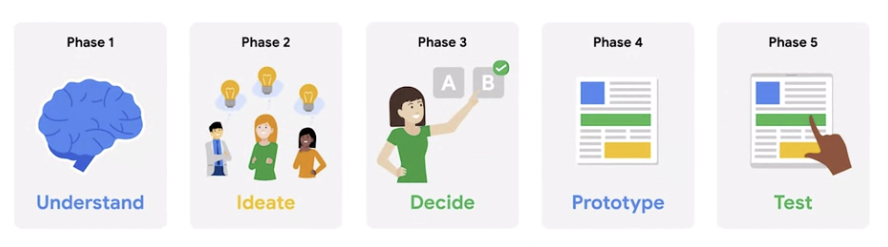

# Google UX Design Course

# Starting the program

## What is Your Career Identity | Google Career Certificates

**Strengths:** What skills, knowledge and talents set me apart?

**Answer:** I'm creative, self-evaluative and empathetic.

**Motivations:** What fuels and motivates me most?

**Answer:** I'm motivated by creating user-friendly solutions that everyone can understand, as I find it frustrating when poor design prevents people from knowing what to do and how to do it.

**Values:** What values guide me?

**Answer:** Some of my core values are usability, clarity and accessibility.

My career identity statement:

*I am a frontend developer with 2 years of experience from school.
My greatest strengths is that I am creative and empathetic, and I have a talent for being self-evaluative — meaning I have the ability to assess and critique my own work and performance with the aim of continuous improvement.
I am passionate about creating user-friendly solutions that everyone can understand, as I find it frustrating when poor design prevents people from knowing what to do and how to do it, and I value usability, clarity and accessibility.*

## Introduce yourself

Hi! I'm Yardenna from Norway. I just finished my 2-year education in frontend developement. However, my passion is working with user experience design. I've always loved viewing and creating art and design, and used to draw and paint a lot. When my brother became an interaction designer and introduced me to the field, I realised for the first time what I want to do for a living. I am passionate about creating user-friendly solutions that everyone can understand, as I find it frustrating when poor design prevents people from knowing what to do and how to do it, and I value usability, clarity and accessibility. Enrolling in this course is very exciting, as it allows me to finally start learning about UX design in depth.

# Course 1 — Foundations of User Experience Design

# Module 1 — Introducing user experience design

## The basics of user experience design

**User experience:** How a person, the user, feels about interacting with, or experiencing, a product.

**Product:** A good, service, or feature.

For a user to have a good experience, the product needs to be
- Usable
- Equitable
- Enjoyable
- Useful

UX is about improving usability, or making something esasier to use. This means that the design, structure and purpose of the product is clear to everyone.
UX designers need to think about every person who uses the product. This might include people with disabilities, or people with very different life experiences from your own.

Being equitable means your designs are useful and marketable to people with diverse abilities and backgrounds.

UX is also about making things enjoyable to use, which creates a positive connection between the user and the product. UX designers foster that positive connection, by taking a user's thoughts and feelings into account when making products.
To know how users feel, we have to collect evidence on how they're experiencing that product in real time, and ask them about it too.

As humans, we want products that are useful, meaning they solve our problems. For example: If you're lost, a map app, telling you how to get home, is useful. But if the app can't find your current location, it's not so useful anymore.

When people like a product, they use that product a lot, and they reccommend it to their friends. And more people using the product, means better business for the company. Plus, when people have a good experience with a product, they're more likely to have a positive opinion of the company that made it. A win-win for the user and the business.

## Jobs in the field of user experience

UX designers tend to be curious about people and like thinking about how people's minds work. They also enjoy figuring out how people use products and how to make those products easier to use. UX designers are empathetic too. Empathy is the ability to understand someone else's feelings or thoughts in a situation, and it's a major part of UX.

**Interaction designers:** Focus on designing the experience of a product and how it functions. They figure out how to connect the users' needs and the business's goals with what's actually feasible to build.
An interaction designer's work answers questions like: What should happen if a user taps on this button? How do we make this action easier for users to complete? And, how are the design elements within the website laid out? Interaction designers focus less on how the product looks and instead strive to make the product easy to navigate and simple for users to interact with.

**Visual designers:** Focus on how a product or technology looks. They might be responsible for designing logos, illustrations, or icons. They may also decide font color and size, or work on product layouts.
The role of a visual designer is to answer questions like: What kind of visual style should icons have, in order to fit the product's branding? Or, which color and font should we use for this button? The goal of a visual designer is to delight users with designs that inspire, engage, and excite them.

**Motion designers:** Think about what it feels like for a user to move through a product and how to create smooth transitions between pages on an app or a website.
A motion designer’s work answers questions like: How should an app transition between pages? How do we show the connection between these actions? And, what’s an engaging animation that will help tell our story? Motion designers focus on design elements that move, rather than traditional static designs.

**Graphic designers:** Create visuals that tell a story or message. Graphic designers usually work on the appearance of a physical product, like an invitation or a poster, while UX designers focus on how users interact with the product.

**UX researchers:** Conduct the studies or interviews that help us learn how people use a product. UX researchers often identify pain points that users are experiencing and explore how products can help solve those problems. They also explore the usability of existing products, by asking users to complete tasks in an app or website, for example.
UX researchers answer questions like: What problems are users facing? Is the design of this product easy to use? And, would people be interested in this new design feature? The goal of UX researchers is often to understand how a product can provide a solution to a real problem users are having.

**UX writers:** Think about how to make the language within a product clearer to make the user experience more intuitive. This could include writing labels for buttons or adjusting the tone to be formal or friendly.
UX writers focus on answering questions like: What words should be used to communicate this idea clearly? Should the tone for this app be friendly or technical? And, what should the language on this button label say? UX writers often become subject matter experts in order to present content that’s easy to understand for all users. 

**Production designers:** (Often act as a bridge between interaction designers and engineers.) They make sure the first and final designs match in the finished product materials and that the assets are ready to be handed off to the engineering team. The assets are everything from text and images to the design specifications, like font style, color, size, and spacing.

**UX engineers:** (One of the groups that UX designers work with most frequently.) Translate the design's intent into a functioning experience, like a website or an app.
UX engineers answer questions like: How do we implement each interaction? How do we build this design in a way that stays true to its original intent? And, how might we explore alternatives to determine the best user experience? UX engineers synthesize design and development, bringing product concepts to life. 

**UX program managers:** Ensure clear and timely communication so that the process of building a useful product moves smoothly from start to finish. This might include setting up goals and writing project plans.
UX program managers answer questions like: What are the overall goals for this project, and what’s the plan to achieve them? And, how can we create and improve processes within the team? UX program managers work across departments to make sure that UX is involved throughout a project lifecycle.

## Most common UX tools 

Sketch, Freehand, and Zeplin

- Work well with very large teams that may struggle to adopt new tools¨
- Paired most commonly with another of these tools
- Do not require WiFi, enabling offline design work
- Do not afford real-time collaboration, prototyping, or design to development collaborative activities

Adobe XD

- Works well with teams that already use Adobe’s Suite
- Rounds out Adobe’s suite of products with one that is entirely built for digital and UX design work
- Syncs to Cloud rather than using actual real-time collaboration and can be used offline

Figma

- Is excellent for most designers and contexts
- Includes FigJam access, a whiteboard for brainstorming, diagramming, and strategizing
- Requires WiFi connection
- Is a digital-first, remote-friendly, all-in-one tool, allowing for easier sharing, designing, collaboration, and reviewing in our ever-changing, more virtual workspace

## The product development life cycle

**Product development lifecycle:** The process used to take a product from an idea to reality.

There are five stages in the product development lifecycle:

- **Brainstorm:** An active discovery stage that's all about generating ideas about the user and potential needs or challenges the user might have.
- **Define:** Using the insights from the brainstorm stage and starting to narrow the focus.
- **Design:** Implementing insights into new designs using various tools.
- **Test:** Evaluating the product design based on the feedback of potential users.
- **Launch:** Sharing a finished version of the product with the public.

## Identify good user experience

**Usable**

The “Add to cart,” “Back to browse,” and “Checkout” buttons in the Foodieland app are examples of usable design because they clearly indicate what will happen next when users interact with them.

**Equitable**

The Foodieland app’s translation feature is an example of equitable design because it is helpful for people who speak different languages.

**Enjoyable**

The images used in the Foodieland app are examples of enjoyable design because they are visually appealing and help users understand what they’re ordering.

**Useful**

The Foodieland app’s filter feature allows users to narrow down their search. This is an example of useful design because it helps users easily select a pizza to order.

**Going forward**

As you continue on your UX design journey, ensure that your designs employ these four characteristics of good UX design.

## Job responsibilities of entry-level UX designers

**Research:** Understand audiences and learn about their backgrounds, demographics, like age and location, motivations, pain points, emotions, and life goals. There's a lot to learn about users and their preferences, and UX designers want to discover as much as they can in order to inform their product's design.

**Wireframe:** An outline or a sketch of a product or a screen. It helps a designer figure out how a page is arranged, where each piece of a product fits in with the others, and how users will likely interact with the product. Wireframing is one of the first steps designers take when building a new product or feature. It's done after or at the same time as the research. We can wireframe by drawing on paper or digitally on a computer.

**Prototype:** An early model of a product that demonstrates functionality like a wireframe, but a lot more advanced. While a wireframe gives you a general idea of where things go and how the product will function, a prototype illustrates a progression from one screen to the next. We can draw prototypes on paper, create a physical prototype, or build a digital prototype.

The purpose of wireframes and prototypes is to figure out the best design for a product, inexpensively and quickly.

**Information architecture:** The framework of a website or how it's organized, categorized, and structured. For example, when you click the file menu on a word processing application like Google Docs, you expect certain options like new or print to appear in the drop down menu. Or when you click on the company's homepage, you expect to find a link to an about page. That structure is the website's information architecture.

**Communicate effectively:** Like meetings with colleagues, writing emails, creating proposals, or pitching clients. UX design is a very collaborative field, so being able to communicate both digitally and face-to-face with teammates is important. You need to be a good listener, be receptive to feedback, and share your ideas in a clear way.

So in short, entry level UX designers should know how to research, wireframe, prototype, create information architecture, and communicate effectively. Your exact responsibilities will vary depending on where you work and how specialized you need to be for your particular job.

## Specialists., generalists, and T-shaped designers

**Generalist:** A UX designer with a broad number of responsibilities. Generalist UX designers are common at smaller companies with fewer employees, as these companies don't have big design departments. You might have to wear many hats. A generalist might be responsible for a combination of:
- User research
- Branding
- User flows
- UX writing
- Visual design
- Prototyping
- Production design
- Information architecture
- Usability testing

**Specialist:** Dives deep into one particular UX design role, like interaction, visual, or motion design. While a generalist has a breadth of knowledge, a specialist has more depth of knowledge in one kind of UX design. Specialists usually work at large companies where the organization can afford to have a big team of UX designers.

**T-shaped designer:** Specializes in one kind of UX design and has a breadth of knowledge in other areas. This is called a T-shaped designer because your skills look like an uppercase T. The vertical line of the T is the kind of UX design you specialize in, like visual design. The horizontal line across the top of the T includes your complementary skills. These skills might come from other fields, like interaction design, that cross over with your specialties or soft skills that help you work more effectively.

Becoming a specialist or generalist isn't always a conscious choice. It might be based entirely on where you work and what skills are needed.

## Interact with cross-functional teammates

**Teams that UX designers work with**

Cross-functional teams come in lots of shapes and sizes, depending on the organization you work for and the project you’re working on. In general, though, there are a handful of key team members that you’ll get to work with as a UX designer.

**Engineers:** Engineers translate designs into a functioning experience, like an app or a website. They help UX teams figure out if designs are feasible from a technical standpoint and bring that idea to life. Working closely with engineers and involving them early in the design process is critical to ensure your project is set up for success.

**UX researchers:** UX research is all about understanding what users need and expect from your product. UX researchers use methods like observations, interviews, and surveys to understand users' unique perspectives. Findings from research can inform your design decisions each step of the way. If you work at a startup or small business, there’s a good chance you’ll get to do your own UX research. At larger companies though, you’ll likely work with designated UX researchers who will provide research findings to inform your design work.

**Program managers:** Program managers ensure clear and timely communication across the team, so that the process of building a useful product moves smoothly from start to finish. Program managers supervise, support, and keep track of the project as a whole. They assign tasks to team members, monitor the project budget, and manage timelines, among other things. Think of your team’s program manager as your go-to source of support when facing any setbacks or issues with your work.

**Product leads:** Product leads are in charge of ensuring the final product’s success and communicating with stakeholders. Your product lead will define the project’s core goals and deliverables, so you can focus on creating innovative design solutions. At some companies, product leads are known as product managers.

**Other UX designers:** In many cases, you won’t be the sole designer working on a given project, especially if you work at a larger company and when you're a new designer. For example, as an entry-level UX designer, you might collaborate with a more experienced visual designer who can ensure that your designs adhere to the company’s brand standards for things like color and font. Working with other designers is a great chance to learn and ask questions!

## Understand the types of companies that hire UX designers

**Startup:** A new business that wants to develop a unique product or service and bring it to market. Small businesses are privately owned businesses with few employees. A lot of UX designers are excited to start work at startups or small businesses because they can see the impact of their work more quickly and develop a broader range of skills.

Advantages:

- **Team size:** Close-knit team and able to work directly with upper management.
- **Growth:** Opportunity for growth due to taking on many responsibilities (visual design, interaction design, user research, and more).
- **Creativity:** Usually more creative freedom with fewer guidelines and processes.
- **Impact:** Lots of impact on final products, with few people working on a project.

Disadvantages:

- **Mentorship:** Fewer mentors to choose from within a smaller company.
- **Responsibility:** Most of the responsibility for a UX project falls solely on you, which can be stressful if you have little UX experience.
- **Speed:** Have to be comfortable working quickly and launching work that isn’t perfect, with little oversight.

**Big companies:** At a big company, like Google, you’re likely to work in teams on a specific project. Lots of UX designers want to work at big companies with the people who developed some of the most well-known products in the world. UX teams at larger companies tend to be more compartmentalized by specialization, making it easier for you to become an expert in one particular area of UX.

Advantages:

- **Mentorship:** A variety of experienced designers and other UXers to learn from.
- **Growth:** Lots of opportunity for growth because there are many levels of designers and management.
- **Guidelines:** Clearer guidelines to keep products uniform and on brand.
- **Team size:** More people working on one project, which means you’re better able to focus on your specific responsibilities.
- **Specialization:** Opportunity to focus on one particular area of design.

Disadvantages:

- **Team size:** May feel less impactful or important as a contributor with lots of other designers on the project.
- **Impact:** May feel small at a company with so many features and products.
- **Guidelines:** Defined guidelines can be restrictive to creativity.

**Design agencies:** A one- stop-shop for the look of brands, products, and services. Working at a design agency can be similar in some ways to working at a small business or startup, except you have multiple companies as your clients. Many agencies tend to work on a broad range of products, so you can explore many kinds of styles and approaches to UX design.

Advantages:

- **Impact:** Lots of impact on projects, if you’re the only UX designer on the team.
- **Networking:** Opportunity to work with senior stakeholders, different teams, and diverse clients.
- **Exposure:** Exposure to lots of companies and industries with different clients.
- **Resume:** Potential to work with large brands and display that work in your portfolio.

Disadvantages:

- **Mentorship:** Lack of mentorship if you are the only UX designer on a project.
- **Monotony:** Depending on the agency, you could work only on the same type of projects.
- **Ownership:** Might not be able to work on a project from start to finish.
- **Finished product:** Products you work on might not launch, depending on client priorities.

**Advertising agencies** Teams of creatives hired by clients to build marketing campaigns. Sometimes called “creative technologists,” these designers work to create ads for brands using UX principles. This is a great option if you’re open to learning some interesting skills outside of a core UX design role.

Advantages:

- **Autonomy:** Little to no middle management means more autonomy over your work.
- **Learning:** Opportunity to learn about other disciplines, like branding, marketing, and graphic design.
- **Variety:** Every project is different based on the client.
- **Networking:** Work with a bunch of different brands, clients, and teams.

Disadvantages:

- **Specialization:** Wide variation in projects, so you might not be able to hone in on specific skills easily.
- **Relevance:** Work may often involve branding and marketing, and might not focus on UX design.

**Freelancers:** Work for themselves and market their services to businesses to find customers. Freelancers are self-employed UX designers who are hired by clients for their independent services. Being a freelancer gives you a lot of freedom, and it’s a great way for new UX designers to gain experience in the field and add work to their portfolio. 

Advantages:

- **Schedule:** Set your own hours since you’re self-employed.
- **Flexibility:** Can freelance while working another job or balancing competing priorities.
- **Autonomy:** Choose the work that you want to do.
- **Experience:** Build your portfolio, especially if you don’t have a full-time UX job.

Disadvantages:

- **Structure:** No one to report to, which means you have to be responsible for getting work done on time.
- **Stability:** Less stable than working for a company or agency, since work is not always guaranteed.
- **Business:** Manage the logistics of your own business, such as filing taxes, billing clients, and more.
- **Mentorship:** Lack of readily available mentors since you’re working by yourself.

## Pursue a career in UX design

**Internship:** A short-term job with limited responsibility. You often work closely with a supervisor to learn more about a job or industry that you are interning in. It's a fantastic way to get real job experience. Plus an internship might lead to a full-time job in the future.

**Apprenticeships:** Provide on-the-job training to help you develop real skills. Apprenticeships are similar to internships, because you work closely with an experienced professional. However, apprenticeships generally last longer than internships: around one or two years instead of a few months. And apprenticeships are always paid.

**Freelancers:** Freelancers work for themselves and market their services to businesses to find customers. Working as a freelancer can help you gain experience on real UX design projects. A good way to get started as a freelancer is to offer your services to a small business or a nonprofit in exchange for a good recommendation and a project to include in your portfolio. Once you have a couple of projects under your belt and some references, you can begin charging customers.

**Entry-level jobs:** Roles that do not require prior experience in the field.

# Module 2 — Thinking like a UX designer

## Get to know UX design best practices and trends

**Universal design:** The process of creating one product for users with the widest range of abilities and in the widest range of situations.

**Inclusive design:** Making design choises that take into account personal identifiers like:

- Ability
- Race
- Economic status
- Language
- Age
- Gender

**Digital Literacy:** A user's level of ability related to using digital information and technologies.

**Accessibility:** The design of products, devices, services, or environments for people with disabilities.

**Equity-focused design:** Designing for groups that have been historically underrepresented or ignored when building products. Thinking through all the aspects of a design product and making sure the product is both accessible and fair to all genders, races, and abilities. Plus, the designs need to specifically consider underrepresented and excluded groups.

Equality means providing the same amount of opportunity and support to all segments of society. In other words, everyone gets the same thing.

Equity means providing different levels of opportunity and support for each person in order to achieve fair outcomes.

**Platform:** The medium that users experience your product on.

Some common platforms are:

- Desktop computers
- Laptop computers
- Mobile phones
- Tablets
- Wearables, like smart watches
- TVs
- Smart displays

**Brand identity:** The visual appearance and voice of a company. For example, Google Search should look and feel the same on your desktop computer and mobile phone.

**Responsive web design:** Allows a website to change automatically, depending on the size of the device.

Users behave differently depending on their device.

Key considerations when designing for different platforms:

- Screen size

Adjusting design elements and features to fit different screen sizes. For example, you have a lot of screen space when you design for desktop and laptop computers. But when you design for smaller screens, like mobile phones, you have to carefully decide which parts of the design you'll prioritize including in the limited space. This means making every word, icon, and image count!

- Interaction

Consider the way users interact with each platform and how those interactions might affect your design decisions. It’s also critical to consider accessibility when developing your designs at each point. Different groups of people will interact with your product in different ways, like using a screen reader, closed captioning, or a switch device.

- Content layout

In the world of UX design, layouts refer to the way that information is organized on the screen. For example, when designing for desktop or laptop computers, you have the advantage of working with a familiar, standardized size: landscape (horizontal) mode. The screen is wide, content can be laid out in columns, and there’s much more flexibility to design. 

In contrast, mobile phone content is usually laid out in portrait (vertical) mode, which is ideal for scrolling. In addition, mobile phones often allow users the option to use landscape (horizontal) mode by rotating their device. Implementing this in your designs requires more work from you as a designer, but provides users with a wider range of options.

Consider the layout of content on a couple more platforms: tablets combine both the desktop and mobile phone user experience, which means you can incorporate aspects of desktop and mobile phone content layouts in your designs. Smartwatches tend to have compact square or rectangular screens, offering very little digital real estate to lay out content.

- Functionality

There are a lot of reasons why users might choose one platform over another, but functionality and the kind of tasks they want to complete is a huge driver. Your designs for each platform will likely vary based on how and when you expect users to need the product.

## Get to know the user

**User:** A person who is trying to solve a problem and is looking for a product or service to help them solve it.

**User experience:** The journey that the user takes with that product or service.

As a UX designer, your goal is to keep the user at the center of every decision you make, and to do that, you need to get to know your user.

To reach as many users as possible, you’ll consider questions such as these as part of your user research approach:

- Do my users have impairments or disabilities to consider–whether temporary, situational, or permanent?
- How familiar are my users with technology?
- How are my users accessing the product or service?
- Where and when are my users accessing the product or service?
- Have I considered all my potential users?

The goal for user research is to get the widest possible selection of potential users to include as research participants. Make sure to consider income level; demographic data such as age, gender, and ethnicity; educational background; and geographic location. 

**User-centered design:** Puts the user front-and-center. Trying to solve problems that people commonly experience rather than trying to solve only those problems that you experience personally.

Focusing on the user means considering their story, emotions, and the insights you've gathered about them.

To keep our focus on the user, the user-centered design process has four steps:

- Understand
- Specify
- Design
- Evaluate

Following this framework helps us build products people actually want to use.

First, **understand** how the user experiences the product or similar products. Really understanding the end user requires a lot of research.

Next, **specify** the end user's needs. Based on your research, you'll narrow down which end-user problem is the most important to solve.

Then, **design** solutions to the end user's problem. This is where you'll come up with ideas for what the product might look like and actually start building the product.

Finally, **evaluate** your design against your end user's needs. Does your design solve the end user's problem?

**Iterate:** Revise the original design to create a new and improved version.

**Iteration:** Doing something again, by building on previous versions and making tweaks.

**Assistive Technology (AT):** Any products, equipment, and systems that enhance learning, working, and daily living for people with disabilities.

**Color modification:** Features that increase the color contrast on a screen, like high contrast mode or dark mode, to make it easier to see for users with low vision or eye strain.

**Voice control and switch devices:** Help people with limited dexterity and can serve as an alternative to a keyboard or mouse.

**Voice control:** Allows users to navigate and interact with the buttons and screens on their devices using only their voice.

**Switch:** An assistive technology device that replaces the need to use a computer keyboard or a mouse.

**Screen readers:** One of the most common assistive technologies for people with limited vision. The software works on mobile and web devices and reads out loud any on screen text. Screen readers also read any interactive elements, like buttons, along with non visible text, like the button names, and any alternative text for images.

**Alternative text (alt text):** Helps translate a visual user interface into a text-based user interface. Essentially uses words to describe any meaningful image for someone who isn't able to see the image. Super helpful for those with low bandwidth connections, too. If your device is unable to maintain a connection to the internet, it may struggle to load a big file or image. Alt text is useful for context when an image fails to load.

You don't need to have a disability to benefit from assistive technology.

**Speech to text** is a great example. With speech to text, a user composes text by speaking into their phone or computer. The voice recording is automatically converted into text. A lot of people find it much easier to text by talking to their device, because it offers a hands-free experience and reduces the amount of mental energy needed to type.

Effective UX designers consider assistive technology throughout the design process, from understanding users’ experiences, to identifying users’ needs, to designing and testing solutions.

# Module 3 — Joining design sprints

## The UX Design Framework

**Framework (in the world of UX design):** A conceptual tool that provides guidance on the best practices and processes for solving  problems and building solutions that solve the problems of real users. Frameworks provide structure for the design process and foster collaboration, which can spark innovations. Most UX designers follow a specific framework or process when approaching their work, from the first idea all the way through to the final launch of a product.

**Design thinking framework:** A user-centered approach to problem-solving that includes activities like research, prototyping, and testing to help you understand who your user is, what their problems are, and what your design should include.

The design thinking framework involves the following phases:

- Empathize
- Define
- Ideate
- Prototype
- Test

Though it may sound like a linear process, the design thinking framework should be iterative, which means that you’ll repeat certain phases as you refine your designs. For example, depending on the feedback you receive during testing, you might need to conduct additional research, brainstorm new ideas, or develop new prototypes.

**Empathize**

During the **empathize** phase, your primary goal is to learn more about the user and their problems, wants, and needs, and the environment or context in which they’ll experience your design. The most important part of the empathize phase is to step away from your assumptions and guesses and let your research findings inform your decision-making in later design phases.

Your user research might include user surveys, interviews, and observation sessions, and you might also need to conduct some research on the competitors’ products to determine how your user frames competitors’ products as part of their daily life and daily problem-solving.

**Define**

In the **define** phase, you’ll analyze your research findings from the empathize phase and determine which user problems are the most important ones to solve, and why. This will drive you toward a clear goal for the design of the product.

The most important outcome of this phase is a clear problem statement, which is a description of the user’s need that your designs will address. You might also develop a value proposition, which is a summary of why your user would or should use the product or service that you’re designing.

**Ideate**

After you land on a user problem and establish why it’s an important one to solve, it’s time for the **ideate** phase. The goal of ideation is to come up with as many design solutions as possible—don’t settle for your first solution because the most obvious solution is not always the right one.

Ideation involves collaborative brainstorming with other members of your team to generate as many solutions as possible to a problem. This could include marketing, engineering, product management, or any other stakeholders for the product or service. During brainstorming sessions, you should explore all possible solutions. Don’t focus on whether something is a “good” or “bad” idea, just collect as many ideas as you can. The important thing here is to keep this process judgment-free.

After brainstorming, you’ll then analyze your potential solutions and start to make choices about which ones are the best options to pursue as prototypes. You might return to user or competitive research to help you narrow down your ideas, and you might also create user flows to illustrate how the user will interact with your solution.

**Prototype and Test**

After you have an idea of how to solve the problem, you’re ready to enter the **prototype** phase, where your goal is to produce an early model of a product that demonstrates its functionality and can be used for testing. The **test** phase is critical to developing the right solution to address your user’s problem, and an organized approach to testing can help you create exceptional user experiences.

Prototyping and testing are interconnected, which means that you’ll test your designs at each stage of prototype development rather than waiting to test until after the working prototype is complete. If the design is too polished the first time you present it to users, you might not get as much feedback. Think about ways to include testing throughout the design process, so that you’re iterating your designs based on user feedback instead of other reasons.

For example, you might test the concepts behind your design by presenting users with a simple sketch, wireframe, or a sitemap. Taking what you learned, you might iterate on that design to a more detailed design on paper (known as a low-fidelity prototype) and conduct another round of user testing. At some point, you’ll iterate the design again into a working, interactive model using a software program (also known as a high-fidelity prototype) and test that as well. You might also consider testing more than one prototype at the same time to get feedback on multiple solutions, or testing the same prototype on multiple platforms, such as a laptop, tablet, and smartphone. 

The goal of testing prototypes is to continue to refine the prototype as you gain insight into whether the design for your product or service is easy to use and solves the user’s problem. At some point, you’ll finalize a prototype, and then you’ll provide it to developers, who will then turn your design into a product.

**Key takeaways**

The design thinking framework is only one type of framework that UX designers use to organize their approach to designs, often based on the product they’re designing and the organization they’re working for. No matter which frameworks you use in your career, they all have a few core principles in common:

- Focus on the user.
- Create solutions that address the user’s problems.
- Collaborate with teammates across departments.
- Validate your designs.
- Iterate as needed to design the right user experience.

**Business requirements**

For any UX design project, business requirements come from whatever entity assigns the project. That entity might be a for-profit business, a nonprofit organization, a governmental organization, or something else. But no matter where they come from, business requirements typically include two kinds of information: goals and parameters.

Business goals typically describe:

- The users they want the design to target
- The outcomes they want the design to achieve
- Their vision for the design’s final look and functionality

Business parameters typically describe:

- The project’s budget, timeline, and scope
- The specific tools and systems that designers must use or design for
- The requirements and standards the design must meet

Business requirements vary depending on the project and its key players, and they can often be negotiated over the project’s lifecycle. And just as these requirements may evolve over the course of the project, so too should they shape designers’ execution of the design thinking process in powerful ways. In the empathize phase, for example, UX designers connect with users and gather information about their needs. This task costs time and money, so it should be conducted in ways that fit the project’s schedule and budget.

**Key takeaways**

Though design thinking technically starts with empathizing, actual design projects typically start with business requirements. Business requirements are goals and parameters set by whatever business or other entity is assigning the design project. They state crucial details like the business’s budget, timeframe, and vision for the design. Effective UX designers understand these requirements and consider them at every stage of the Design Thinking process.

**Phase 1: Empathize with users**

In the empathize phase of design thinking, designers seek to understand their users through a variety of research methods, including interviews, empathy maps, and user personas.

The goal of empathizing is to understand  users' problems, wants, needs, and situations in order to design a product that works for them and creates an enjoyable experience. Throughout this phase, good UX designers try to understand users as deeply as they can while still working within key business requirements, like timeline and budget.

Here are some powerful methods for empathizing with users as a UX designer:

**Interviews**

Interviews take many forms, but UX designers most commonly use four: 

1. Questionnaires/surveys
2. In-person interviews
3. Phone interviews
4. Video interviews

Before starting interviews, designers consider the type and amount of information they need. Next, good designers consider their business requirements: how much time, money, and other resources do they have for planning and conducting interviews? Finally, designers can plan interviews that achieve the best balance between their information needs and their project’s parameters. 

**Empathy maps**

Once designers have conducted their interviews, they can turn to empathy maps. These are a great tool for processing the information a designer has collected. In a classic empathy map, designers draw directly from interviews to answer five questions about their users:

1. Who exactly **are** the users and what are their situations?
2. What do users **say** about their experiences with the product or similar products?
3. What do users **think** about their experiences?
4. What do users **do** before, during, and after their experiences?
5. What do users **feel** about their experiences?

Ideally, the answers to these questions will build on any user information included in a project’s business requirements. 

**User personas**

Personas are fictional characters who represent groups of similar users. They help designers distill large amounts of user information into more manageable chunks. 

Once designers have established personas, they can keep their users in mind throughout the design thinking process without having to remember every detail they captured during their interviews. These personas also help designers explain their design choices to clients and other business stakeholders. Rather than try to describe their users in the abstract, they use user personas to tell compelling stories that put their designs in context.

**Phase 2: Define users’ needs**

In the define phase of design thinking, designers build on their business requirements and empathy work to state a series of specific problems they want their design to address. These problems should emerge from a thorough understanding of who users are and how they experience the product, including the specific tasks they encounter and the feelings they bring to those tasks.

Designers analyze their empathy work to answer this key question: Which of my users’ needs or problems are the most important ones for my design to address? Typically, designers use a combination of tools to answer this question.

**User stories**

While a user persona distills a large group of similar users into a single character, user stories help designers focus their understanding of those users even more. A user story is a one-sentence narrative told from a persona’s perspective. It should encapsulate **who** the user is, **what** they want to do, and **why** they want to do it. The following is a simple template for writing a user story: 

As **[type of user]**, I want to **[action]** so that **[benefit]**.

When done well, a user story gives the designer information they can use to create a checklist they can return to as they define their users’ needs and ideate effective solutions.

**User journeys**

Once a designer has distilled their user groups into realistic personas and stories, it’s time to start mapping out each persona’s user journey. A user journey is a series of experiences that the user has as they try to achieve their goal. It might be an experience they have with the product that’s being designed, an experience they have with a similar product, or an experience they have in the absence of those products.

**Problem statements**

With complete user journeys for each persona, a designer can better identify the problems their design must solve or the needs their design must address. Then, they can distill these problems or needs into problem statements. 

A problem statement summarizes **who** the user is, **what** they need from a design, and **why**. The following is a simple template for writing a problem statement:

**[Name of user persona]** is a **[type of user]** who needs **[type of user experience]** because **[benefits of user experience]**.

This template is similar to a user story, but problem statements are typically more detailed, and they are written from the designer’s perspective.

Effective UX designers create problem statements for each of their user personas. This helps designers create products that address the needs of multiple user types rather than catering solely to one type of user.

**Phase 3: Ideate solutions**

In the ideate phase of design thinking, UX designers brainstorm lots of possible solutions to the user problems they’ve identified. They use brainstorming and research techniques like “How might we?” (HMW), Rapid Sketching, competitive audits, and SCAMPER. It should be a fun, creative, and judgment-free process: The more ideas, the better! But once the ideas are out there, good UX designers take time to check possible solutions against their project’s business requirements. Ultimately, their goal is to choose the solution that will satisfy requirements while also working best for users.

Here are some of the most common techniques for brainstorming:

**“How might we?”**

In this brainstorming exercise, designers take a problem statement from the define phase and turn it into a list of questions that start with “How might we,” or HMW.  HMW questions help designers reframe user problems as exciting opportunities for solutions.

After creating these HMW questions, good UX designers spend time answering them with as many possible solutions as they can think of—and they don’t hold back!

**Rapid Sketching**

While “How might we?” focuses on written questions and solutions, Rapid Sketching is a visual approach to ideation. (It’s commonly called “Crazy Eights” in the UX design industry.) Rapid Sketching is especially useful when designers need to brainstorm the visual elements of a new design. First, designers clarify the problem they’re trying to solve or the idea they’re trying to iterate. They might use one of the questions or solutions they developed in a HMW exercise. Then, they:

1. Divide a large sheet of paper into eight squares.
2. Grab something to draw with.
3. Start an eight-minute timer.
4. Take one minute to sketch an idea or solution in each square.

When the eight-minute timer goes off, there should be a different sketch in each of the paper’s eight squares. Designers can adapt this approach as needed. For example, if a designer has less time or smaller sheets of paper, they might start with four squares and four minutes for sketching.

**Competitive audits**

When designers want new ideas about how to solve a problem, they can also audit their competitors by asking questions, like: 

- What products do they offer?
- What are those products’ strengths and areas for improvement?

By answering questions like these, designers can get inspiration for their own designs, identify gaps in the market, and find evidence for what designs have already worked and not worked.  With audits, designers can save time, money, and effort by learning from competitors who have already designed similar products or tried to solve similar problems.

**SCAMPER**

SCAMPER is a technique designers used to brainstorm changes and alternatives to ideas and designs. Each letter of the acronym stands for a different action that designers can apply to their designs, such as substituting (S) elements for other elements, combining (C) elements into one, or adapting (A) elements with alternatives. In full, the acronym stands for: Substitute, Combine, Adapt, Modify, Put to another use, Eliminate, and Rearrange. 

**Collaboration**

Ideation typically works best when it’s collaborative. Effective design teams often ideate together in collaborative working sessions. And whether they’re working alone or in a team, designers often bring other players into the ideation process, including their users and their business stakeholders. 

Before launching a collaborative partnership or working session, effective designers or design teams typically ensure they’ve answered crucial questions such as:

- Who will be involved? What will their roles be?
- Where will the collaboration happen? Will it be in person or virtual?
- Why is the collaboration happening? What is the end goal?
- How will the collaboration happen? What tools and processes will we use?

**Business requirements**

Ideation techniques help designers brainstorm lots of ideas, but will those ideas meet their project’s business requirements? As designers review their ideas, they must refer to their business requirements and ask questions like these:

- Which of these ideas will be feasible within the project’s budget and schedule?
- Which of these ideas will best meet the standards for the design?

While ideation starts with exploring boundless possibilities, there will always be firm parameters for a project. Good UX designers often try to frame these parameters positively: They are obstacles that inspire creative problem solving, guardrails that keep the design process on track, and filters for sifting through all those boundless possibilities.

**Phase 4: Prototype solutions**

In the prototyping phase, the goal is not to build a final product. Rather, designers produce early models, or prototypes, of the solution so they can see how it will look and function for users. Prototypes also show stakeholders and potential users what the design can do. So, how do designers prototype? There are many practices they can use.

**Information architecture (IA) and sitemaps**

Essentially a high-level diagram or flowchart that shows how users can move through a product, like a website or an app.

In planning a product’s information architecture, designers often create something called a sitemap, like this one for a website:

Like all good information architecture, this sitemap organizes the product by outlining its hierarchy and sequence:

- Hierarchy refers to how topics are prioritized and subordinated. Hierarchies emphasize topics that are broader or more important, which in turn contain smaller or less important topics. In the sitemap above, for example, “Shop” is a major topic that contains smaller topics, like “Denim/Pants.”
- Sequence refers to the order in which users can navigate through the product’s hierarchy, like navigating from the “Homepage” to “Shop” to “Denim/Pants” and so on.

**Wireframing**

Wireframes are rough sketches of the product that bring the sitemap to life. Designers use them to figure out how the product’s pages are laid out, how each page’s elements are arranged, and how users will progress from page to page. They are relatively bare bones, consisting primarily of shapes, lines, and minimal text. There are two methods designers can employ:

**Paper wireframes**

Paper wireframes are sketches on paper. They use horizontal lines to represent text, rectangles or boxes to represent icons or images, and other shapes to represent buttons and additional elements. It’s easy and inexpensive to iterate many versions with paper.

**Digital wireframes**

Digital wireframes are developed in a UX design tool such as Figma or Adobe XD. Digital wireframes are 2D designs that show, at a high level, what the product will look like. Designers use grayscale, shapes, and placeholder text to demonstrate what the design will look and feel like when content is added.

**Low fidelity (lo-fi) prototypes**

In UX, “fidelity” means how closely a design matches the look and feel of the final product. A low fidelity prototype is a simple interactive model that provides a basic idea of what the product will look like and how its components will flow for users. Designers often create lo-fi prototypes by assembling their wireframes and adding interactivity, or the ability to navigate from one screen to another. Designers use lo-fi prototypes to test and improve their designs before spending time and effort developing more detailed high-fidelity prototypes.

**High fidelity (hi-fi) prototypes**

A high fidelity prototype takes the lo-fi prototype and brings it as close to the final product as possible. Hi-fi prototypes incorporate all of the product’s components, interactivity, and content, though some content may be represented by realistic placeholders. It is not the final product, but it enables people to more fully experience how the product will look, feel, and work. For example, consider the richly detailed hi-fi prototype for Tee’s Shirts below. More than just an assembly of navigable wireframes, this hi-fi prototype will enable testers and stakeholders to simulate a realistic experience with the final product, which means richer and more detailed feedback for designers on every facet of the final product.

During prototyping, whether lo-fi or hi-fi, designers often revisit information and decisions from earlier stages of the design thinking process. When evaluating prototypes, for example, they should ask if the layout, flow, look, and feel address the problem statement developed during the define phase.

**Phase 5: Test solutions**

In the test phase, the goal is to refine the prototype as designers gain insight into whether or not it solves the defined problem.

Effective testing aims to reveal what users think, feel, and experience as they use a product, such as a website or an app. To get rich and unbiased results, good testing starts with a plan. Let’s briefly explore the key elements of UX testing by considering the who, what, when, where, why, and how of a testing plan:

**Who will participate in the tests?** Early on, designers might ask friends, colleagues, design partners, or other informal participants to test a product and offer feedback. Later on, ideal participants include real-life users who align with the project’s user personas.

**What types of tests will be conducted?**

**When and where will the tests be conducted?** Tests can be conducted in person or virtually, in a range of different environments or communication channels. It all depends: Good UX designers plan tests that achieve the best balance between their needs and their project’s business requirements.

**Why are the tests conducted?** UX tests are conducted for a range of reasons, but the core goal is always to understand users and improve their experiences. During the test phase of design thinking, some of the most common reasons for testing are to:

- **Validate ideas, information, or decisions** from other parts of the design thinking process, such as user information generated during the empathize phase or design decisions made during ideation.
- **Uncover usability issues** to address with further iteration and prototyping. Users experience these issues as pain points that prevent them from using the product and achieving their goals with ease and enjoyment.

**How will participants engage with the prototype?** Here, a key consideration is whether the testing process itself is inclusive and accessible for all participants. Effective testing incorporates assistive technologies and other inclusive elements to ensure all participants can engage fully.

**How will information be collected?** Designers use a range of methods to collect information from users, including observation and interviews. They may also be able to gather information from the prototype itself or the systems that participants use to interact with the prototype.

Once the testing is done, the prototype will be finalized, and the prototype will move on to the developers, who will turn the design into the actual product.

## Understand design sprints

**Design sprint:** A time-bound process with five phases typically spread out over five full, eight-hour days.

The goal of design sprints is to solve a critical design challenge through designing, prototyping, and testing ideas with users.

Design sprints generally include five phases:

- Understand
- Ideate
- Decide
- Prototype
- Test

**Design sprint benefits**

- Save time
- Create a path to bring a product to market
- Prioritize the user
- Test product before launch

Before launching into a design sprint, you need to review your design challenge and ask yourself these key questions:

- Are there many potential solutions to your design challenge?
- Does a design challenge require people from cross-functional teams to weigh in?
- Is the design challenge's scope wide enough for a sprint?

If you answered yes to any one of these questions, a design sprint might be the right move.

**Understand**

The understand phase sets your sprint on the right track and helps your team get a clear picture of the design challenge. Your team takes time to learn from experts and engage in creative discussions with a lot of different people from other departments and industries. These conversations help you more clearly understand the design challenge.

But what's the first rule of UX design? The user comes first. This means everything your team does during the sprint should focus on the user.

**Ideate**

You start this phase by coming up with ideas and building off of them to create solutions. Once you've got the team thinking, each participant takes time to sketch and present their ideas. Don't worry about your drawing skills here, the idea is what matters.

On top of all the ideating that happens in phase two, you also need to start planning for user testing, which happens in phase five of the sprint. During user testing, you'll have a diverse group of people test your product and provide feedback. To be able to do this, you need to start recruiting users that fit your target profile now, so the sprint stays on schedule. By the time you reach phase three, you have a lot of potential solutions for your design challenge.

**Decide**

Now it's time to decide which solutions you want to build. Finally, you'll wrap up the day by creating a step-by-step blueprint for your prototype.

**Prototype**

You're now ready to build the first version of your new app feature. At the end of this phase, you don't need a finished product, just something realistic enough to test with users. By focusing only on what the user experiences on their screen, your team creates a working prototype. During this phase, you also finish prepping for user testing by confirming the test schedule, finalizing interview questions, and making sure your prototype is good to go.

**Testing**

Now it's time to put your prototype in front of users. As users test your prototype, you observe how they react and then interview them about their experiences. Your team gains critical insight about changes that need to be made before you launch the new feature.

**Benefits of design sprints**

- It's all about the user
- Value every person in the room
- The best ideas rise to the top
- Time to focus
- Lowers risks
- Versatile scheduling
