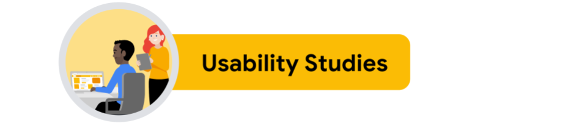
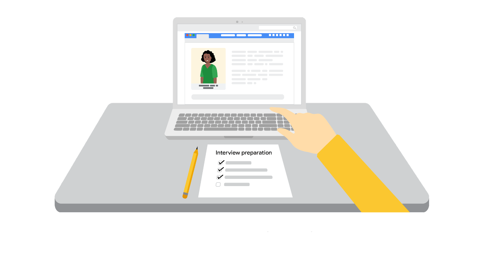

# Google UX Design Course

# Starting the program

## What is Your Career Identity | Google Career Certificates

**Strengths:** What skills, knowledge and talents set me apart?

**Answer:** I'm creative, self-evaluative and empathetic.

**Motivations:** What fuels and motivates me most?

**Answer:** I'm motivated by creating user-friendly solutions that everyone can understand, as I find it frustrating when poor design prevents people from knowing what to do and how to do it.

**Values:** What values guide me?

**Answer:** Some of my core values are usability, clarity and accessibility.

My career identity statement:

*I am a frontend developer with 2 years of experience from school.
My greatest strengths is that I am creative and empathetic, and I have a talent for being self-evaluative — meaning I have the ability to assess and critique my own work and performance with the aim of continuous improvement.
I am passionate about creating user-friendly solutions that everyone can understand, as I find it frustrating when poor design prevents people from knowing what to do and how to do it, and I value usability, clarity and accessibility.*

## Introduce yourself

Hi! I'm Yardenna from Norway. I just finished my 2-year education in frontend developement. However, my passion is working with user experience design. I've always loved viewing and creating art and design, and used to draw and paint a lot. When my brother became an interaction designer and introduced me to the field, I realised for the first time what I want to do for a living. I am passionate about creating user-friendly solutions that everyone can understand, as I find it frustrating when poor design prevents people from knowing what to do and how to do it, and I value usability, clarity and accessibility. Enrolling in this course is very exciting, as it allows me to finally start learning about UX design in depth.

# Course 1 — Foundations of User Experience Design

# Module 1 — Introducing user experience design

## The basics of user experience design

**User experience:** How a person, the user, feels about interacting with, or experiencing, a product.

**Product:** A good, service, or feature.

For a user to have a good experience, the product needs to be
- Usable
- Equitable
- Enjoyable
- Useful

UX is about improving usability, or making something esasier to use. This means that the design, structure and purpose of the product is clear to everyone.
UX designers need to think about every person who uses the product. This might include people with disabilities, or people with very different life experiences from your own.

Being equitable means your designs are useful and marketable to people with diverse abilities and backgrounds.

UX is also about making things enjoyable to use, which creates a positive connection between the user and the product. UX designers foster that positive connection, by taking a user's thoughts and feelings into account when making products.
To know how users feel, we have to collect evidence on how they're experiencing that product in real time, and ask them about it too.

As humans, we want products that are useful, meaning they solve our problems. For example: If you're lost, a map app, telling you how to get home, is useful. But if the app can't find your current location, it's not so useful anymore.

When people like a product, they use that product a lot, and they reccommend it to their friends. And more people using the product, means better business for the company. Plus, when people have a good experience with a product, they're more likely to have a positive opinion of the company that made it. A win-win for the user and the business.

## Jobs in the field of user experience

UX designers tend to be curious about people and like thinking about how people's minds work. They also enjoy figuring out how people use products and how to make those products easier to use. UX designers are empathetic too. Empathy is the ability to understand someone else's feelings or thoughts in a situation, and it's a major part of UX.

**Interaction designers:** Focus on designing the experience of a product and how it functions. They figure out how to connect the users' needs and the business's goals with what's actually feasible to build.
An interaction designer's work answers questions like: What should happen if a user taps on this button? How do we make this action easier for users to complete? And, how are the design elements within the website laid out? Interaction designers focus less on how the product looks and instead strive to make the product easy to navigate and simple for users to interact with.

**Visual designers:** Focus on how a product or technology looks. They might be responsible for designing logos, illustrations, or icons. They may also decide font color and size, or work on product layouts.
The role of a visual designer is to answer questions like: What kind of visual style should icons have, in order to fit the product's branding? Or, which color and font should we use for this button? The goal of a visual designer is to delight users with designs that inspire, engage, and excite them.

**Motion designers:** Think about what it feels like for a user to move through a product and how to create smooth transitions between pages on an app or a website.
A motion designer’s work answers questions like: How should an app transition between pages? How do we show the connection between these actions? And, what’s an engaging animation that will help tell our story? Motion designers focus on design elements that move, rather than traditional static designs.

**Graphic designers:** Create visuals that tell a story or message. Graphic designers usually work on the appearance of a physical product, like an invitation or a poster, while UX designers focus on how users interact with the product.

**UX researchers:** Conduct the studies or interviews that help us learn how people use a product. UX researchers often identify pain points that users are experiencing and explore how products can help solve those problems. They also explore the usability of existing products, by asking users to complete tasks in an app or website, for example.
UX researchers answer questions like: What problems are users facing? Is the design of this product easy to use? And, would people be interested in this new design feature? The goal of UX researchers is often to understand how a product can provide a solution to a real problem users are having.

**UX writers:** Think about how to make the language within a product clearer to make the user experience more intuitive. This could include writing labels for buttons or adjusting the tone to be formal or friendly.
UX writers focus on answering questions like: What words should be used to communicate this idea clearly? Should the tone for this app be friendly or technical? And, what should the language on this button label say? UX writers often become subject matter experts in order to present content that’s easy to understand for all users. 

**Production designers:** (Often act as a bridge between interaction designers and engineers.) They make sure the first and final designs match in the finished product materials and that the assets are ready to be handed off to the engineering team. The assets are everything from text and images to the design specifications, like font style, color, size, and spacing.

**UX engineers:** (One of the groups that UX designers work with most frequently.) Translate the design's intent into a functioning experience, like a website or an app.
UX engineers answer questions like: How do we implement each interaction? How do we build this design in a way that stays true to its original intent? And, how might we explore alternatives to determine the best user experience? UX engineers synthesize design and development, bringing product concepts to life. 

**UX program managers:** Ensure clear and timely communication so that the process of building a useful product moves smoothly from start to finish. This might include setting up goals and writing project plans.
UX program managers answer questions like: What are the overall goals for this project, and what’s the plan to achieve them? And, how can we create and improve processes within the team? UX program managers work across departments to make sure that UX is involved throughout a project lifecycle.

## Most common UX tools 

Sketch, Freehand, and Zeplin

- Work well with very large teams that may struggle to adopt new tools¨
- Paired most commonly with another of these tools
- Do not require WiFi, enabling offline design work
- Do not afford real-time collaboration, prototyping, or design to development collaborative activities

Adobe XD

- Works well with teams that already use Adobe’s Suite
- Rounds out Adobe’s suite of products with one that is entirely built for digital and UX design work
- Syncs to Cloud rather than using actual real-time collaboration and can be used offline

Figma

- Is excellent for most designers and contexts
- Includes FigJam access, a whiteboard for brainstorming, diagramming, and strategizing
- Requires WiFi connection
- Is a digital-first, remote-friendly, all-in-one tool, allowing for easier sharing, designing, collaboration, and reviewing in our ever-changing, more virtual workspace

## The product development life cycle

**Product development lifecycle:** The process used to take a product from an idea to reality.

There are five stages in the product development lifecycle:

- **Brainstorm:** An active discovery stage that's all about generating ideas about the user and potential needs or challenges the user might have.
- **Define:** Using the insights from the brainstorm stage and starting to narrow the focus.
- **Design:** Implementing insights into new designs using various tools.
- **Test:** Evaluating the product design based on the feedback of potential users.
- **Launch:** Sharing a finished version of the product with the public.

## Identify good user experience

**Usable**

The “Add to cart,” “Back to browse,” and “Checkout” buttons in the Foodieland app are examples of usable design because they clearly indicate what will happen next when users interact with them.

**Equitable**

The Foodieland app’s translation feature is an example of equitable design because it is helpful for people who speak different languages.

**Enjoyable**

The images used in the Foodieland app are examples of enjoyable design because they are visually appealing and help users understand what they’re ordering.

**Useful**

The Foodieland app’s filter feature allows users to narrow down their search. This is an example of useful design because it helps users easily select a pizza to order.

**Going forward**

As you continue on your UX design journey, ensure that your designs employ these four characteristics of good UX design.

## Job responsibilities of entry-level UX designers

**Research:** Understand audiences and learn about their backgrounds, demographics, like age and location, motivations, pain points, emotions, and life goals. There's a lot to learn about users and their preferences, and UX designers want to discover as much as they can in order to inform their product's design.

**Wireframe:** An outline or a sketch of a product or a screen. It helps a designer figure out how a page is arranged, where each piece of a product fits in with the others, and how users will likely interact with the product. Wireframing is one of the first steps designers take when building a new product or feature. It's done after or at the same time as the research. We can wireframe by drawing on paper or digitally on a computer.

**Prototype:** An early model of a product that demonstrates functionality like a wireframe, but a lot more advanced. While a wireframe gives you a general idea of where things go and how the product will function, a prototype illustrates a progression from one screen to the next. We can draw prototypes on paper, create a physical prototype, or build a digital prototype.

The purpose of wireframes and prototypes is to figure out the best design for a product, inexpensively and quickly.

**Information architecture:** The framework of a website or how it's organized, categorized, and structured. For example, when you click the file menu on a word processing application like Google Docs, you expect certain options like new or print to appear in the drop down menu. Or when you click on the company's homepage, you expect to find a link to an about page. That structure is the website's information architecture.

**Communicate effectively:** Like meetings with colleagues, writing emails, creating proposals, or pitching clients. UX design is a very collaborative field, so being able to communicate both digitally and face-to-face with teammates is important. You need to be a good listener, be receptive to feedback, and share your ideas in a clear way.

So in short, entry level UX designers should know how to research, wireframe, prototype, create information architecture, and communicate effectively. Your exact responsibilities will vary depending on where you work and how specialized you need to be for your particular job.

## Specialists., generalists, and T-shaped designers

**Generalist:** A UX designer with a broad number of responsibilities. Generalist UX designers are common at smaller companies with fewer employees, as these companies don't have big design departments. You might have to wear many hats. A generalist might be responsible for a combination of:
- User research
- Branding
- User flows
- UX writing
- Visual design
- Prototyping
- Production design
- Information architecture
- Usability testing

**Specialist:** Dives deep into one particular UX design role, like interaction, visual, or motion design. While a generalist has a breadth of knowledge, a specialist has more depth of knowledge in one kind of UX design. Specialists usually work at large companies where the organization can afford to have a big team of UX designers.

**T-shaped designer:** Specializes in one kind of UX design and has a breadth of knowledge in other areas. This is called a T-shaped designer because your skills look like an uppercase T. The vertical line of the T is the kind of UX design you specialize in, like visual design. The horizontal line across the top of the T includes your complementary skills. These skills might come from other fields, like interaction design, that cross over with your specialties or soft skills that help you work more effectively.

Becoming a specialist or generalist isn't always a conscious choice. It might be based entirely on where you work and what skills are needed.

## Interact with cross-functional teammates

**Teams that UX designers work with**

Cross-functional teams come in lots of shapes and sizes, depending on the organization you work for and the project you’re working on. In general, though, there are a handful of key team members that you’ll get to work with as a UX designer.

**Engineers:** Engineers translate designs into a functioning experience, like an app or a website. They help UX teams figure out if designs are feasible from a technical standpoint and bring that idea to life. Working closely with engineers and involving them early in the design process is critical to ensure your project is set up for success.

**UX researchers:** UX research is all about understanding what users need and expect from your product. UX researchers use methods like observations, interviews, and surveys to understand users' unique perspectives. Findings from research can inform your design decisions each step of the way. If you work at a startup or small business, there’s a good chance you’ll get to do your own UX research. At larger companies though, you’ll likely work with designated UX researchers who will provide research findings to inform your design work.

**Program managers:** Program managers ensure clear and timely communication across the team, so that the process of building a useful product moves smoothly from start to finish. Program managers supervise, support, and keep track of the project as a whole. They assign tasks to team members, monitor the project budget, and manage timelines, among other things. Think of your team’s program manager as your go-to source of support when facing any setbacks or issues with your work.

**Product leads:** Product leads are in charge of ensuring the final product’s success and communicating with stakeholders. Your product lead will define the project’s core goals and deliverables, so you can focus on creating innovative design solutions. At some companies, product leads are known as product managers.

**Other UX designers:** In many cases, you won’t be the sole designer working on a given project, especially if you work at a larger company and when you're a new designer. For example, as an entry-level UX designer, you might collaborate with a more experienced visual designer who can ensure that your designs adhere to the company’s brand standards for things like color and font. Working with other designers is a great chance to learn and ask questions!

## Understand the types of companies that hire UX designers

**Startup:** A new business that wants to develop a unique product or service and bring it to market. Small businesses are privately owned businesses with few employees. A lot of UX designers are excited to start work at startups or small businesses because they can see the impact of their work more quickly and develop a broader range of skills.

Advantages:

- **Team size:** Close-knit team and able to work directly with upper management.
- **Growth:** Opportunity for growth due to taking on many responsibilities (visual design, interaction design, user research, and more).
- **Creativity:** Usually more creative freedom with fewer guidelines and processes.
- **Impact:** Lots of impact on final products, with few people working on a project.

Disadvantages:

- **Mentorship:** Fewer mentors to choose from within a smaller company.
- **Responsibility:** Most of the responsibility for a UX project falls solely on you, which can be stressful if you have little UX experience.
- **Speed:** Have to be comfortable working quickly and launching work that isn’t perfect, with little oversight.

**Big companies:** At a big company, like Google, you’re likely to work in teams on a specific project. Lots of UX designers want to work at big companies with the people who developed some of the most well-known products in the world. UX teams at larger companies tend to be more compartmentalized by specialization, making it easier for you to become an expert in one particular area of UX.

Advantages:

- **Mentorship:** A variety of experienced designers and other UXers to learn from.
- **Growth:** Lots of opportunity for growth because there are many levels of designers and management.
- **Guidelines:** Clearer guidelines to keep products uniform and on brand.
- **Team size:** More people working on one project, which means you’re better able to focus on your specific responsibilities.
- **Specialization:** Opportunity to focus on one particular area of design.

Disadvantages:

- **Team size:** May feel less impactful or important as a contributor with lots of other designers on the project.
- **Impact:** May feel small at a company with so many features and products.
- **Guidelines:** Defined guidelines can be restrictive to creativity.

**Design agencies:** A one- stop-shop for the look of brands, products, and services. Working at a design agency can be similar in some ways to working at a small business or startup, except you have multiple companies as your clients. Many agencies tend to work on a broad range of products, so you can explore many kinds of styles and approaches to UX design.

Advantages:

- **Impact:** Lots of impact on projects, if you’re the only UX designer on the team.
- **Networking:** Opportunity to work with senior stakeholders, different teams, and diverse clients.
- **Exposure:** Exposure to lots of companies and industries with different clients.
- **Resume:** Potential to work with large brands and display that work in your portfolio.

Disadvantages:

- **Mentorship:** Lack of mentorship if you are the only UX designer on a project.
- **Monotony:** Depending on the agency, you could work only on the same type of projects.
- **Ownership:** Might not be able to work on a project from start to finish.
- **Finished product:** Products you work on might not launch, depending on client priorities.

**Advertising agencies** Teams of creatives hired by clients to build marketing campaigns. Sometimes called “creative technologists,” these designers work to create ads for brands using UX principles. This is a great option if you’re open to learning some interesting skills outside of a core UX design role.

Advantages:

- **Autonomy:** Little to no middle management means more autonomy over your work.
- **Learning:** Opportunity to learn about other disciplines, like branding, marketing, and graphic design.
- **Variety:** Every project is different based on the client.
- **Networking:** Work with a bunch of different brands, clients, and teams.

Disadvantages:

- **Specialization:** Wide variation in projects, so you might not be able to hone in on specific skills easily.
- **Relevance:** Work may often involve branding and marketing, and might not focus on UX design.

**Freelancers:** Work for themselves and market their services to businesses to find customers. Freelancers are self-employed UX designers who are hired by clients for their independent services. Being a freelancer gives you a lot of freedom, and it’s a great way for new UX designers to gain experience in the field and add work to their portfolio. 

Advantages:

- **Schedule:** Set your own hours since you’re self-employed.
- **Flexibility:** Can freelance while working another job or balancing competing priorities.
- **Autonomy:** Choose the work that you want to do.
- **Experience:** Build your portfolio, especially if you don’t have a full-time UX job.

Disadvantages:

- **Structure:** No one to report to, which means you have to be responsible for getting work done on time.
- **Stability:** Less stable than working for a company or agency, since work is not always guaranteed.
- **Business:** Manage the logistics of your own business, such as filing taxes, billing clients, and more.
- **Mentorship:** Lack of readily available mentors since you’re working by yourself.

## Pursue a career in UX design

**Internship:** A short-term job with limited responsibility. You often work closely with a supervisor to learn more about a job or industry that you are interning in. It's a fantastic way to get real job experience. Plus an internship might lead to a full-time job in the future.

**Apprenticeships:** Provide on-the-job training to help you develop real skills. Apprenticeships are similar to internships, because you work closely with an experienced professional. However, apprenticeships generally last longer than internships: around one or two years instead of a few months. And apprenticeships are always paid.

**Freelancers:** Freelancers work for themselves and market their services to businesses to find customers. Working as a freelancer can help you gain experience on real UX design projects. A good way to get started as a freelancer is to offer your services to a small business or a nonprofit in exchange for a good recommendation and a project to include in your portfolio. Once you have a couple of projects under your belt and some references, you can begin charging customers.

**Entry-level jobs:** Roles that do not require prior experience in the field.

# Module 2 — Thinking like a UX designer

## Get to know UX design best practices and trends

**Universal design:** The process of creating one product for users with the widest range of abilities and in the widest range of situations.

**Inclusive design:** Making design choises that take into account personal identifiers like:

- Ability
- Race
- Economic status
- Language
- Age
- Gender

**Digital Literacy:** A user's level of ability related to using digital information and technologies.

**Accessibility:** The design of products, devices, services, or environments for people with disabilities.

**Equity-focused design:** Designing for groups that have been historically underrepresented or ignored when building products. Thinking through all the aspects of a design product and making sure the product is both accessible and fair to all genders, races, and abilities. Plus, the designs need to specifically consider underrepresented and excluded groups.

Equality means providing the same amount of opportunity and support to all segments of society. In other words, everyone gets the same thing.

Equity means providing different levels of opportunity and support for each person in order to achieve fair outcomes.

**Platform:** The medium that users experience your product on.

Some common platforms are:

- Desktop computers
- Laptop computers
- Mobile phones
- Tablets
- Wearables, like smart watches
- TVs
- Smart displays

**Brand identity:** The visual appearance and voice of a company. For example, Google Search should look and feel the same on your desktop computer and mobile phone.

**Responsive web design:** Allows a website to change automatically, depending on the size of the device.

Users behave differently depending on their device.

Key considerations when designing for different platforms:

- Screen size

Adjusting design elements and features to fit different screen sizes. For example, you have a lot of screen space when you design for desktop and laptop computers. But when you design for smaller screens, like mobile phones, you have to carefully decide which parts of the design you'll prioritize including in the limited space. This means making every word, icon, and image count!

- Interaction

Consider the way users interact with each platform and how those interactions might affect your design decisions. It’s also critical to consider accessibility when developing your designs at each point. Different groups of people will interact with your product in different ways, like using a screen reader, closed captioning, or a switch device.

- Content layout

In the world of UX design, layouts refer to the way that information is organized on the screen. For example, when designing for desktop or laptop computers, you have the advantage of working with a familiar, standardized size: landscape (horizontal) mode. The screen is wide, content can be laid out in columns, and there’s much more flexibility to design. 

In contrast, mobile phone content is usually laid out in portrait (vertical) mode, which is ideal for scrolling. In addition, mobile phones often allow users the option to use landscape (horizontal) mode by rotating their device. Implementing this in your designs requires more work from you as a designer, but provides users with a wider range of options.

Consider the layout of content on a couple more platforms: tablets combine both the desktop and mobile phone user experience, which means you can incorporate aspects of desktop and mobile phone content layouts in your designs. Smartwatches tend to have compact square or rectangular screens, offering very little digital real estate to lay out content.

- Functionality

There are a lot of reasons why users might choose one platform over another, but functionality and the kind of tasks they want to complete is a huge driver. Your designs for each platform will likely vary based on how and when you expect users to need the product.

## Get to know the user

**User:** A person who is trying to solve a problem and is looking for a product or service to help them solve it.

**User experience:** The journey that the user takes with that product or service.

As a UX designer, your goal is to keep the user at the center of every decision you make, and to do that, you need to get to know your user.

To reach as many users as possible, you’ll consider questions such as these as part of your user research approach:

- Do my users have impairments or disabilities to consider–whether temporary, situational, or permanent?
- How familiar are my users with technology?
- How are my users accessing the product or service?
- Where and when are my users accessing the product or service?
- Have I considered all my potential users?

The goal for user research is to get the widest possible selection of potential users to include as research participants. Make sure to consider income level; demographic data such as age, gender, and ethnicity; educational background; and geographic location. 

**User-centered design:** Puts the user front-and-center. Trying to solve problems that people commonly experience rather than trying to solve only those problems that you experience personally.

Focusing on the user means considering their story, emotions, and the insights you've gathered about them.

To keep our focus on the user, the user-centered design process has four steps:

- Understand
- Specify
- Design
- Evaluate

Following this framework helps us build products people actually want to use.

First, **understand** how the user experiences the product or similar products. Really understanding the end user requires a lot of research.

Next, **specify** the end user's needs. Based on your research, you'll narrow down which end-user problem is the most important to solve.

Then, **design** solutions to the end user's problem. This is where you'll come up with ideas for what the product might look like and actually start building the product.

Finally, **evaluate** your design against your end user's needs. Does your design solve the end user's problem?

**Iterate:** Revise the original design to create a new and improved version.

**Iteration:** Doing something again, by building on previous versions and making tweaks.

**Assistive Technology (AT):** Any products, equipment, and systems that enhance learning, working, and daily living for people with disabilities.

**Color modification:** Features that increase the color contrast on a screen, like high contrast mode or dark mode, to make it easier to see for users with low vision or eye strain.

**Voice control and switch devices:** Help people with limited dexterity and can serve as an alternative to a keyboard or mouse.

**Voice control:** Allows users to navigate and interact with the buttons and screens on their devices using only their voice.

**Switch:** An assistive technology device that replaces the need to use a computer keyboard or a mouse.

**Screen readers:** One of the most common assistive technologies for people with limited vision. The software works on mobile and web devices and reads out loud any on screen text. Screen readers also read any interactive elements, like buttons, along with non visible text, like the button names, and any alternative text for images.

**Alternative text (alt text):** Helps translate a visual user interface into a text-based user interface. Essentially uses words to describe any meaningful image for someone who isn't able to see the image. Super helpful for those with low bandwidth connections, too. If your device is unable to maintain a connection to the internet, it may struggle to load a big file or image. Alt text is useful for context when an image fails to load.

You don't need to have a disability to benefit from assistive technology.

**Speech to text** is a great example. With speech to text, a user composes text by speaking into their phone or computer. The voice recording is automatically converted into text. A lot of people find it much easier to text by talking to their device, because it offers a hands-free experience and reduces the amount of mental energy needed to type.

Effective UX designers consider assistive technology throughout the design process, from understanding users’ experiences, to identifying users’ needs, to designing and testing solutions.

# Module 3 — Joining design sprints

## The UX Design Framework

**Framework (in the world of UX design):** A conceptual tool that provides guidance on the best practices and processes for solving  problems and building solutions that solve the problems of real users. Frameworks provide structure for the design process and foster collaboration, which can spark innovations. Most UX designers follow a specific framework or process when approaching their work, from the first idea all the way through to the final launch of a product.

**Design thinking framework:** A user-centered approach to problem-solving that includes activities like research, prototyping, and testing to help you understand who your user is, what their problems are, and what your design should include.

The design thinking framework involves the following phases:

- Empathize
- Define
- Ideate
- Prototype
- Test

Though it may sound like a linear process, the design thinking framework should be iterative, which means that you’ll repeat certain phases as you refine your designs. For example, depending on the feedback you receive during testing, you might need to conduct additional research, brainstorm new ideas, or develop new prototypes.

**Empathize**

During the **empathize** phase, your primary goal is to learn more about the user and their problems, wants, and needs, and the environment or context in which they’ll experience your design. The most important part of the empathize phase is to step away from your assumptions and guesses and let your research findings inform your decision-making in later design phases.

Your user research might include user surveys, interviews, and observation sessions, and you might also need to conduct some research on the competitors’ products to determine how your user frames competitors’ products as part of their daily life and daily problem-solving.

**Define**

In the **define** phase, you’ll analyze your research findings from the empathize phase and determine which user problems are the most important ones to solve, and why. This will drive you toward a clear goal for the design of the product.

The most important outcome of this phase is a clear problem statement, which is a description of the user’s need that your designs will address. You might also develop a value proposition, which is a summary of why your user would or should use the product or service that you’re designing.

**Ideate**

After you land on a user problem and establish why it’s an important one to solve, it’s time for the **ideate** phase. The goal of ideation is to come up with as many design solutions as possible—don’t settle for your first solution because the most obvious solution is not always the right one.

Ideation involves collaborative brainstorming with other members of your team to generate as many solutions as possible to a problem. This could include marketing, engineering, product management, or any other stakeholders for the product or service. During brainstorming sessions, you should explore all possible solutions. Don’t focus on whether something is a “good” or “bad” idea, just collect as many ideas as you can. The important thing here is to keep this process judgment-free.

After brainstorming, you’ll then analyze your potential solutions and start to make choices about which ones are the best options to pursue as prototypes. You might return to user or competitive research to help you narrow down your ideas, and you might also create user flows to illustrate how the user will interact with your solution.

**Prototype and Test**

After you have an idea of how to solve the problem, you’re ready to enter the **prototype** phase, where your goal is to produce an early model of a product that demonstrates its functionality and can be used for testing. The **test** phase is critical to developing the right solution to address your user’s problem, and an organized approach to testing can help you create exceptional user experiences.

Prototyping and testing are interconnected, which means that you’ll test your designs at each stage of prototype development rather than waiting to test until after the working prototype is complete. If the design is too polished the first time you present it to users, you might not get as much feedback. Think about ways to include testing throughout the design process, so that you’re iterating your designs based on user feedback instead of other reasons.

For example, you might test the concepts behind your design by presenting users with a simple sketch, wireframe, or a sitemap. Taking what you learned, you might iterate on that design to a more detailed design on paper (known as a low-fidelity prototype) and conduct another round of user testing. At some point, you’ll iterate the design again into a working, interactive model using a software program (also known as a high-fidelity prototype) and test that as well. You might also consider testing more than one prototype at the same time to get feedback on multiple solutions, or testing the same prototype on multiple platforms, such as a laptop, tablet, and smartphone. 

The goal of testing prototypes is to continue to refine the prototype as you gain insight into whether the design for your product or service is easy to use and solves the user’s problem. At some point, you’ll finalize a prototype, and then you’ll provide it to developers, who will then turn your design into a product.

**Key takeaways**

The design thinking framework is only one type of framework that UX designers use to organize their approach to designs, often based on the product they’re designing and the organization they’re working for. No matter which frameworks you use in your career, they all have a few core principles in common:

- Focus on the user.
- Create solutions that address the user’s problems.
- Collaborate with teammates across departments.
- Validate your designs.
- Iterate as needed to design the right user experience.

**Business requirements**

For any UX design project, business requirements come from whatever entity assigns the project. That entity might be a for-profit business, a nonprofit organization, a governmental organization, or something else. But no matter where they come from, business requirements typically include two kinds of information: goals and parameters.

Business goals typically describe:

- The users they want the design to target
- The outcomes they want the design to achieve
- Their vision for the design’s final look and functionality

Business parameters typically describe:

- The project’s budget, timeline, and scope
- The specific tools and systems that designers must use or design for
- The requirements and standards the design must meet

Business requirements vary depending on the project and its key players, and they can often be negotiated over the project’s lifecycle. And just as these requirements may evolve over the course of the project, so too should they shape designers’ execution of the design thinking process in powerful ways. In the empathize phase, for example, UX designers connect with users and gather information about their needs. This task costs time and money, so it should be conducted in ways that fit the project’s schedule and budget.

**Key takeaways**

Though design thinking technically starts with empathizing, actual design projects typically start with business requirements. Business requirements are goals and parameters set by whatever business or other entity is assigning the design project. They state crucial details like the business’s budget, timeframe, and vision for the design. Effective UX designers understand these requirements and consider them at every stage of the Design Thinking process.

**Phase 1: Empathize with users**

In the empathize phase of design thinking, designers seek to understand their users through a variety of research methods, including interviews, empathy maps, and user personas.

The goal of empathizing is to understand  users' problems, wants, needs, and situations in order to design a product that works for them and creates an enjoyable experience. Throughout this phase, good UX designers try to understand users as deeply as they can while still working within key business requirements, like timeline and budget.

Here are some powerful methods for empathizing with users as a UX designer:

**Interviews**

Interviews take many forms, but UX designers most commonly use four: 

1. Questionnaires/surveys
2. In-person interviews
3. Phone interviews
4. Video interviews

Before starting interviews, designers consider the type and amount of information they need. Next, good designers consider their business requirements: how much time, money, and other resources do they have for planning and conducting interviews? Finally, designers can plan interviews that achieve the best balance between their information needs and their project’s parameters. 

**Empathy maps**

Once designers have conducted their interviews, they can turn to empathy maps. These are a great tool for processing the information a designer has collected. In a classic empathy map, designers draw directly from interviews to answer five questions about their users:

1. Who exactly **are** the users and what are their situations?
2. What do users **say** about their experiences with the product or similar products?
3. What do users **think** about their experiences?
4. What do users **do** before, during, and after their experiences?
5. What do users **feel** about their experiences?

Ideally, the answers to these questions will build on any user information included in a project’s business requirements. 

**User personas**

Personas are fictional characters who represent groups of similar users. They help designers distill large amounts of user information into more manageable chunks. 

Once designers have established personas, they can keep their users in mind throughout the design thinking process without having to remember every detail they captured during their interviews. These personas also help designers explain their design choices to clients and other business stakeholders. Rather than try to describe their users in the abstract, they use user personas to tell compelling stories that put their designs in context.

**Phase 2: Define users’ needs**

In the define phase of design thinking, designers build on their business requirements and empathy work to state a series of specific problems they want their design to address. These problems should emerge from a thorough understanding of who users are and how they experience the product, including the specific tasks they encounter and the feelings they bring to those tasks.

Designers analyze their empathy work to answer this key question: Which of my users’ needs or problems are the most important ones for my design to address? Typically, designers use a combination of tools to answer this question.

**User stories**

While a user persona distills a large group of similar users into a single character, user stories help designers focus their understanding of those users even more. A user story is a one-sentence narrative told from a persona’s perspective. It should encapsulate **who** the user is, **what** they want to do, and **why** they want to do it. The following is a simple template for writing a user story: 

As **[type of user]**, I want to **[action]** so that **[benefit]**.

When done well, a user story gives the designer information they can use to create a checklist they can return to as they define their users’ needs and ideate effective solutions.

**User journeys**

Once a designer has distilled their user groups into realistic personas and stories, it’s time to start mapping out each persona’s user journey. A user journey is a series of experiences that the user has as they try to achieve their goal. It might be an experience they have with the product that’s being designed, an experience they have with a similar product, or an experience they have in the absence of those products.

**Problem statements**

With complete user journeys for each persona, a designer can better identify the problems their design must solve or the needs their design must address. Then, they can distill these problems or needs into problem statements. 

A problem statement summarizes **who** the user is, **what** they need from a design, and **why**. The following is a simple template for writing a problem statement:

**[Name of user persona]** is a **[type of user]** who needs **[type of user experience]** because **[benefits of user experience]**.

This template is similar to a user story, but problem statements are typically more detailed, and they are written from the designer’s perspective.

Effective UX designers create problem statements for each of their user personas. This helps designers create products that address the needs of multiple user types rather than catering solely to one type of user.

**Phase 3: Ideate solutions**

In the ideate phase of design thinking, UX designers brainstorm lots of possible solutions to the user problems they’ve identified. They use brainstorming and research techniques like “How might we?” (HMW), Rapid Sketching, competitive audits, and SCAMPER. It should be a fun, creative, and judgment-free process: The more ideas, the better! But once the ideas are out there, good UX designers take time to check possible solutions against their project’s business requirements. Ultimately, their goal is to choose the solution that will satisfy requirements while also working best for users.

Here are some of the most common techniques for brainstorming:

**“How might we?”**

In this brainstorming exercise, designers take a problem statement from the define phase and turn it into a list of questions that start with “How might we,” or HMW.  HMW questions help designers reframe user problems as exciting opportunities for solutions.

After creating these HMW questions, good UX designers spend time answering them with as many possible solutions as they can think of—and they don’t hold back!

**Rapid Sketching**

While “How might we?” focuses on written questions and solutions, Rapid Sketching is a visual approach to ideation. (It’s commonly called “Crazy Eights” in the UX design industry.) Rapid Sketching is especially useful when designers need to brainstorm the visual elements of a new design. First, designers clarify the problem they’re trying to solve or the idea they’re trying to iterate. They might use one of the questions or solutions they developed in a HMW exercise. Then, they:

1. Divide a large sheet of paper into eight squares.
2. Grab something to draw with.
3. Start an eight-minute timer.
4. Take one minute to sketch an idea or solution in each square.

When the eight-minute timer goes off, there should be a different sketch in each of the paper’s eight squares. Designers can adapt this approach as needed. For example, if a designer has less time or smaller sheets of paper, they might start with four squares and four minutes for sketching.

**Competitive audits**

When designers want new ideas about how to solve a problem, they can also audit their competitors by asking questions, like: 

- What products do they offer?
- What are those products’ strengths and areas for improvement?

By answering questions like these, designers can get inspiration for their own designs, identify gaps in the market, and find evidence for what designs have already worked and not worked.  With audits, designers can save time, money, and effort by learning from competitors who have already designed similar products or tried to solve similar problems.

**SCAMPER**

SCAMPER is a technique designers used to brainstorm changes and alternatives to ideas and designs. Each letter of the acronym stands for a different action that designers can apply to their designs, such as substituting (S) elements for other elements, combining (C) elements into one, or adapting (A) elements with alternatives. In full, the acronym stands for: Substitute, Combine, Adapt, Modify, Put to another use, Eliminate, and Rearrange. 

**Collaboration**

Ideation typically works best when it’s collaborative. Effective design teams often ideate together in collaborative working sessions. And whether they’re working alone or in a team, designers often bring other players into the ideation process, including their users and their business stakeholders. 

Before launching a collaborative partnership or working session, effective designers or design teams typically ensure they’ve answered crucial questions such as:

- Who will be involved? What will their roles be?
- Where will the collaboration happen? Will it be in person or virtual?
- Why is the collaboration happening? What is the end goal?
- How will the collaboration happen? What tools and processes will we use?

**Business requirements**

Ideation techniques help designers brainstorm lots of ideas, but will those ideas meet their project’s business requirements? As designers review their ideas, they must refer to their business requirements and ask questions like these:

- Which of these ideas will be feasible within the project’s budget and schedule?
- Which of these ideas will best meet the standards for the design?

While ideation starts with exploring boundless possibilities, there will always be firm parameters for a project. Good UX designers often try to frame these parameters positively: They are obstacles that inspire creative problem solving, guardrails that keep the design process on track, and filters for sifting through all those boundless possibilities.

**Phase 4: Prototype solutions**

In the prototyping phase, the goal is not to build a final product. Rather, designers produce early models, or prototypes, of the solution so they can see how it will look and function for users. Prototypes also show stakeholders and potential users what the design can do. So, how do designers prototype? There are many practices they can use.

**Information architecture (IA) and sitemaps**

Essentially a high-level diagram or flowchart that shows how users can move through a product, like a website or an app.

In planning a product’s information architecture, designers often create something called a sitemap, like this one for a website:

Like all good information architecture, this sitemap organizes the product by outlining its hierarchy and sequence:

- Hierarchy refers to how topics are prioritized and subordinated. Hierarchies emphasize topics that are broader or more important, which in turn contain smaller or less important topics. In the sitemap above, for example, “Shop” is a major topic that contains smaller topics, like “Denim/Pants.”
- Sequence refers to the order in which users can navigate through the product’s hierarchy, like navigating from the “Homepage” to “Shop” to “Denim/Pants” and so on.

**Wireframing**

Wireframes are rough sketches of the product that bring the sitemap to life. Designers use them to figure out how the product’s pages are laid out, how each page’s elements are arranged, and how users will progress from page to page. They are relatively bare bones, consisting primarily of shapes, lines, and minimal text. There are two methods designers can employ:

**Paper wireframes**

Paper wireframes are sketches on paper. They use horizontal lines to represent text, rectangles or boxes to represent icons or images, and other shapes to represent buttons and additional elements. It’s easy and inexpensive to iterate many versions with paper.

**Digital wireframes**

Digital wireframes are developed in a UX design tool such as Figma or Adobe XD. Digital wireframes are 2D designs that show, at a high level, what the product will look like. Designers use grayscale, shapes, and placeholder text to demonstrate what the design will look and feel like when content is added.

**Low fidelity (lo-fi) prototypes**

In UX, “fidelity” means how closely a design matches the look and feel of the final product. A low fidelity prototype is a simple interactive model that provides a basic idea of what the product will look like and how its components will flow for users. Designers often create lo-fi prototypes by assembling their wireframes and adding interactivity, or the ability to navigate from one screen to another. Designers use lo-fi prototypes to test and improve their designs before spending time and effort developing more detailed high-fidelity prototypes.

**High fidelity (hi-fi) prototypes**

A high fidelity prototype takes the lo-fi prototype and brings it as close to the final product as possible. Hi-fi prototypes incorporate all of the product’s components, interactivity, and content, though some content may be represented by realistic placeholders. It is not the final product, but it enables people to more fully experience how the product will look, feel, and work. For example, consider the richly detailed hi-fi prototype for Tee’s Shirts below. More than just an assembly of navigable wireframes, this hi-fi prototype will enable testers and stakeholders to simulate a realistic experience with the final product, which means richer and more detailed feedback for designers on every facet of the final product.

During prototyping, whether lo-fi or hi-fi, designers often revisit information and decisions from earlier stages of the design thinking process. When evaluating prototypes, for example, they should ask if the layout, flow, look, and feel address the problem statement developed during the define phase.

**Phase 5: Test solutions**

In the test phase, the goal is to refine the prototype as designers gain insight into whether or not it solves the defined problem.

Effective testing aims to reveal what users think, feel, and experience as they use a product, such as a website or an app. To get rich and unbiased results, good testing starts with a plan. Let’s briefly explore the key elements of UX testing by considering the who, what, when, where, why, and how of a testing plan:

**Who will participate in the tests?** Early on, designers might ask friends, colleagues, design partners, or other informal participants to test a product and offer feedback. Later on, ideal participants include real-life users who align with the project’s user personas.

**What types of tests will be conducted?**

**When and where will the tests be conducted?** Tests can be conducted in person or virtually, in a range of different environments or communication channels. It all depends: Good UX designers plan tests that achieve the best balance between their needs and their project’s business requirements.

**Why are the tests conducted?** UX tests are conducted for a range of reasons, but the core goal is always to understand users and improve their experiences. During the test phase of design thinking, some of the most common reasons for testing are to:

- **Validate ideas, information, or decisions** from other parts of the design thinking process, such as user information generated during the empathize phase or design decisions made during ideation.
- **Uncover usability issues** to address with further iteration and prototyping. Users experience these issues as pain points that prevent them from using the product and achieving their goals with ease and enjoyment.

**How will participants engage with the prototype?** Here, a key consideration is whether the testing process itself is inclusive and accessible for all participants. Effective testing incorporates assistive technologies and other inclusive elements to ensure all participants can engage fully.

**How will information be collected?** Designers use a range of methods to collect information from users, including observation and interviews. They may also be able to gather information from the prototype itself or the systems that participants use to interact with the prototype.

Once the testing is done, the prototype will be finalized, and the prototype will move on to the developers, who will turn the design into the actual product.

## Understand design sprints

**Design sprint:** A time-bound process with five phases typically spread out over five full, eight-hour days.

The goal of design sprints is to solve a critical design challenge through designing, prototyping, and testing ideas with users.

Design sprints generally include five phases:

- Understand
- Ideate
- Decide
- Prototype
- Test

**Design sprint benefits**

- Save time
- Create a path to bring a product to market
- Prioritize the user
- Test product before launch

Before launching into a design sprint, you need to review your design challenge and ask yourself these key questions:

- Are there many potential solutions to your design challenge?
- Does a design challenge require people from cross-functional teams to weigh in?
- Is the design challenge's scope wide enough for a sprint?

If you answered yes to any one of these questions, a design sprint might be the right move.

**Understand**

The understand phase sets your sprint on the right track and helps your team get a clear picture of the design challenge. Your team takes time to learn from experts and engage in creative discussions with a lot of different people from other departments and industries. These conversations help you more clearly understand the design challenge.

But what's the first rule of UX design? The user comes first. This means everything your team does during the sprint should focus on the user.

**Ideate**

You start this phase by coming up with ideas and building off of them to create solutions. Once you've got the team thinking, each participant takes time to sketch and present their ideas. Don't worry about your drawing skills here, the idea is what matters.

On top of all the ideating that happens in phase two, you also need to start planning for user testing, which happens in phase five of the sprint. During user testing, you'll have a diverse group of people test your product and provide feedback. To be able to do this, you need to start recruiting users that fit your target profile now, so the sprint stays on schedule. By the time you reach phase three, you have a lot of potential solutions for your design challenge.

**Decide**

Now it's time to decide which solutions you want to build. Your team will decide on the solution with the greatest chance of success. Finally, you'll wrap up the day by creating a step-by-step blueprint for your prototype.

**Prototype**

You're now ready to build the first version of your new app feature. At the end of this phase, you don't need a finished product, just something realistic enough to test with users. By focusing only on what the user experiences on their screen, your team creates a working prototype. During this phase, you also finish prepping for user testing by confirming the test schedule, finalizing interview questions, and making sure your prototype is good to go.

**Testing**

Now it's time to put your prototype in front of users. As users test your prototype, you observe how they react and then interview them about their experiences. Your team gains critical insight about changes that need to be made before you launch the new feature.

**Benefits of design sprints**

- It's all about the user
- Value every person in the room
- The best ideas rise to the top
- Time to focus
- Lowers risks
- Versatile scheduling

**Differences between the design thinking framework and design sprints**

**The design thinking framework:**

- Is an overarching framework with five phases: Empathize, Define, Ideate, Prototype, and Test
- Is an overall philosophy for approaching problem solving
- Spans the entire product development process and is open-ended
- Utilizes many different methods and tools

**A design sprint is:**

- A time-bound process with five phases: Understand, Ideate, Decide, Prototype, and Test
- A specific implementation plan for solving a specific design challenge
- Strictly timebound from start to finish, typically spread over five full business days
- One method with a defined process

**Using design sprints to align to the design thinking framework**

Design sprints are an efficient and effective way to keep aligned with the overall goals of the design thinking framework. Since a design sprint typically lasts five consecutive days, it compresses the design thinking process into a focused, intense period of ideation, prototyping, and testing.

Below are some examples of how design sprints can be used to accelerate specific design challenges throughout the design thinking framework.

**Empathize**

During the empathize phase, the design thinking framework focuses on understanding the users and their needs. Design sprints can be deployed in this phase to quickly research user behaviors and preferences, conduct interviews with users, and analyze customer feedback to understand pain points and opportunities for improvement. 

**Define**

Design sprints during the define phase might focus on refining the problem statement, aligning stakeholders, analyzing the user journey, and generating ideas that specifically address the pain points identified in the previous sprint. This focused approach helps lay the groundwork for the following phases of prototyping, testing, and implementation within the design thinking framework.

**Ideate**

In the ideate phase, design sprints can be employed to rapidly generate and evaluate ideas. The time constraints and structured activities of the design sprint can help teams generate a large volume of ideas within a short timeframe.

**Prototype**

The prototype phase is where design sprints find their strongest application. Design sprints excel in creating prototypes that can be tested and validated, and the design sprint approach allows teams to quickly translate ideas into a visual or interactive prototype that represents the potential solution.

**Test**

Design sprints integrate seamlessly into this phase by providing a structure for conducting user testing sessions and collecting feedback on the prototypes developed during the sprint. The insights gained from testing inform further iteration and refinement.

## Plan design sprints

**Step 1. User research**

User research is always the first step in any sprint planning process. Your research should focus on the user problems you're trying to solve during the sprint. You don't have to detail out a specific problem right away. But getting a rough idea of what your sprint will focus on will help you decide which research methods make the most sense.

**Step 2. Call in the experts**

If you're planning the sprint, it's up to you to schedule short talks with colleagues or industry experts. You'll listen to these info-packed talks during the understand phase of the sprint. A good talk helps clarify the problem your sprint is trying to solve. Keep in mind, the more experts you bring in, the more schedules you have to accommodate. Start planning early; we promise, it'll be worth it.

**Step 3. Find the right space**

It's important to ensure that the space allows all employees equal opportunities to perform their job. A few things to look for: Whiteboards to capture your ideas or hang sticky notes, acoustics so participants can hear each other easily, accommodations for anyone who needs them, and comfortable furniture that you can move around easily. You're going to be spending a lot of time in this room, so get cozy.

**Step 4. Gather supplies**

If you're planning the design sprint, it's your job to make sure everyone has what they need to participate, kind of like a teacher handing out classroom supplies. Some essentials include markers, sticky notes, and a lot of snacks and water.

**Step 5. Establish sprint rules**

If you want this to be a gadgetless, distraction-free zone, now is the time to say so. Figuring out the ground rules in advance sets the tone for the sprint, gets everyone on the same page, and helps your team stay focused.

**Step 6. Plan introductions**

This can be pretty important since sprints involve cross-functional teams that may have never met before. We all know icebreakers can be a little cheesy, but they're still a great way to help your team get comfortable with each other. Plus, choosing icebreakers that are relevant to your sprint can motivate your team and put them in the right mindset. Here's an idea for an icebreaker. Ask everyone to talk about a time they called customer service to complain. This puts the team in the shoes of a user, exactly where you want them to be when solving UX design challenges.

**Step 7. Post-sprint planning**

That means thinking about what will happen after the sprint wraps up, like how your team might use what you've learned to achieve other goals. To do this, you need documentation. Make sure you enlist a few people to help document the design sprint by taking pictures, collecting sticky notes, and jotting down ideas.

**Sprint brief:** A document that you'll share with all of your attendees to help them prepare for the sprint.

Things that make up a design sprint brief:

**Sprint challenge**

Introduces your team to the sprint objectives.

**Key deliverables**

What your team actually wants to create by the end of the sprint.

**Logistics**

First, everyone participating in the sprint needs to know **where** the sprint will happen and **when** it will be held. You also want to list **who**'s attending and the name of the **sprint leader**.

**Sprint leader:** Usually the person who sends out the brief to the team. But, that's not always the case. If you want to designate a sprint leader, you should do it before you send out the sprint brief.

**Approvers**

Add approvers. Got some higher-ups that need to sign off on the product before launch? This is the place to note it.

**Resources**

For short-term sprints, there's probably a team already assigned to this project. For long-term sprints, you may need to create a plan to secure additional resources.

**Project overview**

1. Current state of the project
2. Roadblocks
3. Early wins, if any
4. Estimated launch plan

**Sprint schedule**

An hour-by-hour schedule of the five-day sprint, including break times. This lets people know what to expect and gives them time to prep so that you can keep things moving along during the sprint.

## Reflect on design sprints

**Retrospective:** A collaborative critique of the team's design sprint.

These critiques focus on improving the design solution itself, considering factors like usability, visuals, and alignment with user needs. 

We usually do retrospective meetings immediately following the sprint so that everyone's thoughts are fresh. Retrospective meetings don't have any particular agenda. The goal is to make sure everyone who took part in the sprint has a chance to give feedback.

**Key questions in a retrospective:**

- What went well?
- What can be improved?

The person who led the sprint will guide the conversation and someone will take notes so that the team can use the feedback to make the next sprint even more productive.

Retrospectives are super useful. They can help you to work better as a team, improve how you communicate with clients, and even point out areas where you can grow as an individual. Retrospectives are all about empowering, not shaming. If something didn't go well, this is your chance to make sure you have the resources and the tools to do better next time.

**What went well?**

Retrospectives usually start with discussion on the parts of the design sprint that were successful and areas in which the team did well. Maybe a new process was created that could be applied to future sprints. Or maybe the addition of a new digital tool enhanced the team’s productivity. Analyze the team’s wins, and think about how they could be applied to future sprints.

Questions a UX designer might ask during this part of the retrospective include:

- Which tools saved me the most time and effort?
- When did I feel the most satisfaction?
- What helped me make my best contribution to the team during this sprint?

This is also a good time to acknowledge a team member’s strong performance. Celebrating successes builds relationships and increases cohesion and harmony within the team.

**What can be improved?**

After highlighting everything that went well, it’s time to shift gears and think about areas for improvement. The team will want to know what went wrong, so that everyone can do better next time. 

Retrospectives are opportunities to encourage everyone to participate in sharing areas for improvement. Each individual might even take turns going around a circle and adding challenges to a shared list. If anyone is nervous about speaking up, each person can be invited to write their thoughts anonymously. Then, all of the improvements can be reviewed together. 

This process eliminates concerns about causing offense and reduces the chance of groupthink. **Groupthink** can occur in a group discussion when one person shares an opinion and everyone immediately agrees with the opinion, instead of sharing their own feelings about a topic. Groupthink prevents each person from having an equal say, and it might mean certain areas for improvement are overlooked.

Consider each phase of the design sprint to structure the feedback: understand, ideate, decide, prototype, and test. At what point were there missteps? What caused those challenges? Share individual perspectives if a phase or two didn’t go according to plan.

Questions a UX designer might ask during this part of the retrospective include:

- What went wrong that caught me off guard?
- Which problems came up the most often?
- When do I think we experienced the biggest challenge as a team?

Then, a designer examines the sprint’s outcome or final product, and ask questions like:

- Did the team overestimate or underestimate the work required to complete the design?
- Did an external factor derail my productivity?
- Most importantly, does the final design actually solve the user problem?

Identify ways that the team could have ended up with a better solution. 

Keep in mind, retrospectives are about empowering—not shaming. This is not the time to call out an individual for poor performance. If there are issues with a team member’s work, it’s best to address it with that person privately, not during a team-wide retrospective.

**Lessons learned**

By the end of the retrospective meeting, the team will have a better understanding of what went well and what could be improved. Naturally, they’ll want to take lessons learned into their next design sprint. 

Before the next sprint, the team reviews the conclusions reached at the end of the last retrospective. The conclusions should inform how they conduct the next sprint. Perhaps they need to include a more diverse team, allow more time for ideating, or test with additional users before moving forward with a design.

Questions a UX designer might ask include:

- What did I discover during the sprint that I’m still wondering about?
- How could the current process be holding the team back from creating better solutions?

# Module 4 — Integrating research into the design process

## Understand the role of research in design

**User research:** Focuses on understanding user behaviors, needs, and motivations through observation and feedback.

The goal of user experience research is to prioritize the user. We also want to make sure business needs are met. UX research can help bridge the gap between what a business thinks the user needs and what the user actually needs, before an expensive and time-consuming product is made.

**Product developement life cycle:** The process used to take a product from an idea to reality.

User research is a continuous part of the product development life cycle and takes place before, during, and after phase 3: Design.

**Foundational research:** Research that takes place before anything is designed.

Foundational research answers these questions:

- What should we build?
- What are the user's problems?
- How can we solve them?
- Am I aware of my own biases, and am I able to filter them as I do research?

The goal of foundational research is to help define the problem you would like to design a solution for. This research includes talking with users and identifying their pain points when using a product.

**Design research:** Research that takes place during the design phase, phase 3, of the product development life cycle.

Design research answers this question:

- How should we build it?

A list of things you might want to ask users about during this phase of research:

- How was your experience using the prototype today?
- How easy or difficult was it to use? Why?
- Did you encounter any challenges?

The goal of design research is to inform how the product should be built. Design research gives designers a chance to reduce the problems that occur as users interact with your prototype. You can conduct design research very early in the design process when you have paper sketches, or you can wait until you have a prototype to test with users. It just depends on what your key research goals are.

**Post-launch research:** Research that only happens at the end of the product developement life cycle.

Post-launch research can be used to evaluate how well a launch feature is meeting the needs of users.

Post-launch research answers this question:

- Did we succeed?

The goal of post-launch research is to understand how users experienced the product and whether it was a good or poor user experience. You might also want to check your product's performance against the competition.

**UX researcher qualities**

- Emphaty: Able to understand someone else's feelings or thoughts in a situation
- Pragmatism: (Practical approach to problem-solving) Focused on reaching goals
- Collaboration: Can work with a range of people, personalities, and work styles

Your product design should be built upon research and facts, not assumptions. UX research aligns what you, as the designer, *think* the user needs with what the user *actually* needs.

**Foundational research** is always done *before* you start designing. Within the product development life cycle, foundational research happens during the brainstorm stage (stage one) to help you empathize with users, understand their needs, and inspire new design directions. During this stage, you will also make personas and user stories.

In foundational research, your goal is to figure out what the user needs and how to address those needs with your product. Strong foundational research can contradict your personal perspective on what a good solution might be.

Questions you might consider during foundational research include:

- What should we build?
- What are the user’s problems?
- How can we solve those problems?
- Am I aware of my own biases, and am I able to filter them as I do research?

There are lots of research methods for conducting foundational research, but many of them are based on observations. Common foundational research methods include: 

- **Interviews:** A research method used to collect in-depth information on people's opinions, thoughts, experiences, and feelings. You’ll often conduct interviews of your target users themselves.
-  **Surveys:** An activity where many people are asked the same questions in order to understand what most people think about a product.
-  **Focus groups:** A small group of people whose reactions are studied. For example, your focus group might bring together eight users to discuss their perspectives about new features in your design. A focus group is usually run by a moderator who guides the group on a certain topic of conversation.
-   **Competitive audit:** An overview of your competitors’ strengths and weaknesses.
-   **Field studies:** Research activities that take place in the user's context or personal environment, rather than in an office or lab.
-   **Diary studies:** A research method used to collect qualitative data about user behaviors, activities, and experiences over time. Often, a user will log, or diary, about their daily activities and provide information about their behaviors and needs, which can help inform your designs. 

**Design research** is done *while* you design. Within the product development lifecycle, design research happens during the design stage (stage three) to help inform your designs, to fit the needs of users, and to reduce risk. Each time you create a new version of your design, new research should be done to evaluate what works well and what needs to be changed. 

In design research, your goal is to answer the question: How should we build it?

The amount of design research you conduct will vary depending on where you work and what you’re building. The most common method used to conduct design research is a **usability study**, which is a technique to evaluate a product by testing it on users. The goal of usability studies is to identify pain points that the user experiences with your prototypes, so the issues can be fixed before the product launches.

Additional research methods that might be used to conduct design research include:

- **A/B testing:** A research method that evaluates and compares two different aspects of a product to discover which of them is most effective. For example, you might have users evaluate two layouts for the homepage of your app to find out which layout is more effective.
- **Cafe or guerrilla studies:** A research method where user feedback is gathered by taking a design or prototype into the public domain and asking passersby for their thoughts. For example, you might sit in a local coffee shop and ask customers if they would be willing to test your app design for a couple of minutes and provide feedback.
- **Card sorting:** A research method that instructs study participants to sort individual labels written on notecards into categories that make sense to them. This type of research is largely used to figure out the information architecture of your project.
- **Intercepts:** A research method that gathers on-site feedback from users as they engage in the activities being researched. Intercepts are often conducted in the field, so this type of research is often considered a subset of field research. An intercept study can provide quick, high-level feedback.

**Post-launch research** is done *after* the design is complete and your product has launched. Within the product development life cycle, post-launch research happens after the launch stage (stage five) to help validate that the product is meeting user needs through established metrics.

In post-launch research, your goal is to answer the question: Did we succeed? This research will tell you how your final product is performing based on established metrics, such as adoption, usage, user satisfaction, and more. 

You should use research methods that give insight into what the user thinks of your product and if their experience using your product aligns with how you intended it to function. Research methods you might use to conduct post-launch research include:

- **A/B testing**
- **Usability studies**
- **Surveys**
- **Logs analysis:** A research method used to evaluate recordings of users while they interact with your design, tools, etc. 

**The key to a user-focused product: Research**

Research is crucial to creating a product that satisfies users. As an entry-level designer, it might be tempting to assume what the user needs based on your own experience, but as you know: The user comes first. Always make sure that your opinions are backed up by your research. You should get feedback from your users before, during, and after you design!

## Explore UX research methods

**Methods:** How you get the research done.

There are two ways to categorize research: *who conducts* the research and the *type of data* collected.

The first way is based on who conducts the research:

- **Primary research:** Research *you* conduct yourself. For example, you might interview users, survey users, or conduct a usability study to hear from users directly.

- **Secondary research:** Research that uses information *someone else* has put together. Secondary research can be information from books, articles, or journals. Most of the time, secondary research is done at the very beginning of the product development lifecycle, before any ideation happens. Secondary research is often done by product leads, not UX designers. But the insights they share can help you make a stronger case for your design choices and gain more empathy for your users.

The second way is based on the type of data collected:

- **Quantitative research:** Focuses on data that can be *gathered by counting or measuring*. Quantitative research is often based on surveys of large groups of people using numerical answers. This type of research often answers questions like: "How many?" "How much?" If you want to know how the majority of users are experiencing a product, you should use quantitative research.

- **Qualitative research:**  Is primarily collected *through observations and conversations*. Qualitative research is often based on interviews, where we focus on a smaller number of users and understand their needs in greater detail. This type of research answers questions like: "Why?" Or, "how did this happen?" If you want to know why users are having a bad experience with your product and how to improve it, you should use qualitative research.

Here's a quick way to remember the difference:

- Quantitative research gives you the "what"
- Qualitative research gives you the "why."

All four of these types of research can intermix. Primary and secondary research can be both qualitative and quantitative. For example, an interview is qualitative research. An interview conducted by you is primary research. If you review an article about an interview conducted by someone else, it’s secondary research. It’s important to be able to identify the difference between these types of research because the data you collect forms the basis of your design decisions. 

**Primary research methods**

**Interviews:** A research method used to collect in-depth information on people's opinions, thoughts, experiences, and feelings.

Interviews can be performed one-on-one or in a group setting, like a focus group.

Interviews can take the form of qualitative and quantitative research. A qualitative research method includes open-ended questions that require participants to explain their answers by providing more details. A quantitative research method includes only close-ended questions, like questions that require only “yes”  or “no” responses or set multiple choice questions.

Spot the difference:

- How would you rate your experience using the app on a scale of 1-10?
- How was your experience using the app?

The second question is open-ended and allows the user to share more about their experience.

Best practice is to conduct at least five user interviews during your research. As you conduct your interviews, you’ll start to find similarities in the feedback that users provide about what works and what doesn’t work about your product. This is exactly the kind of feedback you want!

Advantages:

- You’re better able to understand what a user thinks and why.
- You can adjust your questions or refocus the discussion based on the user’s answers.
- You have the ability to ask follow-up questions in real time.
- You have the ability to ask questions specific to a user’s needs.
- You’ll receive direct suggestions from the user.

Disadvantages:

- It’s time-consuming to interview each user.
- It’s expensive to pay participants and to rent space for the interviews.
- The sample sizes are smaller, due to time and money constraints.
- Group interviews can be affected by the bandwagon effect, or going along with the group’s opinion instead of thinking creatively, which can discourage open discussion by people who have an opinion that doesn’t align with the majority of the group. 

**Surveys:** An activity where many people are asked the same questions in order to understand what most people think about a product.

Surveys allow us to hear from a larger number of users than we can during interviews. Surveys are a great way to measure the success of your product, during development and after it’s launched. For example, sending surveys after a product is released can help you measure the effectiveness of your product and provide a foundation for future improvements. 

You can design surveys to include open-ended questions for qualitative research, which allow research participants to clarify their survey responses, as well as close-ended questions for quantitative research, which generate numerical data.

Surveys are most useful after you have some initial understanding of the users' pain points and want to solidify that by surveying a larger number of people.

Advantages:

- You can learn more from a larger sample size.
- You are able to gather results and insights quickly.
- Surveys are usually inexpensive because they don’t take as much time for participants to complete, and they can be done remotely. 

Disadvantages:

- Surveys often do not allow for in-depth feedback; most questions will have responses drawn from a set of multiple-choice answers.
- There are some types of research questions that won’t work in a survey format.
- Surveys usually do not allow for personalization.

**Usability study:** A technique that help us evaluate a product by testing it on users.

The goal of a usability study is to identify pain points that the user experiences with different prototypes, so the issues can be fixed before the final product launches. During a usability study, you get a chance to see how your end users interact with your new product or feature, and afterward you can interview the users to learn more about their experience. The usability study data is then used to improve the UX of the design.

Usability studies help demonstrate if a product is on the right track or if the design needs to be adjusted. There are lots of ways to test usability, both in person and online. It’s a good idea to record your usability sessions, either audio or video, so you can reference the user data as you make design decisions later on in the process. 

Qualitative research is based on observations, and a critical part of conducting usability studies is observing how participants interact with the product you’ve designed. Focusing on qualitative research during usability studies can generate more personal insights by assessing the behavior of users as they experience the product. Quantitative research can also be used when conducting usability studies to understand participants’ impressions of the product.

If the product has already launched, a post-launch usability study might include data like success metrics and key performance indicators, which are commonly known as KPIs.

**Key performance indicators (KPIs):** Critical measures of progress toward an end goal.

The KPIs for an app or new product launch might include things like how much time the user spent on a task or the number of clicks they used to make a purchase.

Advantages:

- You can learn from first-hand user interaction and observation.
- Usability studies can challenge your assumptions about your product by demonstrating a completely different result than you were expecting.
- Users can provide in-depth feedback.

Disadvantages:

- Usability studies only measures how easy it is to use a product.
- This type of research can be expensive, especially if it’s conducted in person.
- There can be differences between a “controlled” usability study in a lab versus how a user experiences the product in their real life.

**Secondary research methods**

Secondary research can be completed at any phase of the project, since you’re using information from outside sources. In other words, secondary research is not a direct result of your product or the user you’re designing for. The information you discover during secondary research might lay a foundation for your primary research, so you have a better idea of where to focus your efforts. Or, secondary research might supplement the findings from your primary research for a project, to reiterate or strengthen your conclusions.

Advantages:

- Secondary research is generally cheaper and faster than primary research. This means you’ll save time and money.
- You can often find secondary research via online searches and subscription research publications.
- Secondary research can be a good supplement to findings from your primary research.

Disadvantages:

- You will not learn from any first-hand user interaction.
- You will not receive user feedback specific to your product.
- Secondary research can be misleading and generalizing if not done appropriately.

**The research method we choose is decided by the question we are trying to answer.**

## Identify biases in UX research

**Bias:** Favoring or having prejudice against something based on limited information.

**Confirmation bias:** Occurs when you start looking for evidence to prove a hypothesis you have.

**Overcoming confirmation bias**

- Ask open-ended questions
- Actively listen
- Include a large sample of users

**False consensus bias (the assumption that others will think the same way as you do):** Overestimate the number of people who will agree with our idea or design

**Overcoming false consensus bias**

- Identify and articulate your own assumptions
- Survey large groups of people

**Recency bias:** It's easiest to remember the last thing you heard in an interview, conversation, or similar setting, because it's the most recent.

**Primary bias:** Remember the first participant most strongly

**Overcoming recency & primacy bias bias**

- Take detailed notes or recordings
- Interview each participant in the same way

**Implicit bias (also known as "unconscious bias"):** The collection of attitudes and stereotypes we associate to people without our conscious knowledge

One of the most common forms of implicit bias in UX is when we only interview people within a limited set of identity profiles, such as race, age, gender, socioeconomic status, and ability.

**Overcoming implicit bias**

- Reflect on our behaviors
- Ask others to point our implicit biases

**Sunk cost fallacy:** The deeper we get into a project we've invested in, the harder it is to change course

For UX designers, the sunk cost fallacy comes into play when working on a design. You might have invested hours into designing a new feature, but then learned that the feature doesn't really address a user problem. It's easy to keep working on a design that you've invested time into. But ultimately, you need to focus on work that positively impacts users.

**Overcoming sunk cost fallacy**

- Break down your project into smaller phases
- Outline points where you can decide whether to continue or stop

**Preventing bias in data collection**

**Choose your words carefully.** While conducting research, it’s important to use words that don’t lead the user in one direction or another. Of course, as a designer, you’re going to be partial to the designs you’ve created, and you’ll likely assume that users will appreciate them too. That’s why you designed them! But when asking users questions about their experience using your product, you don’t want them to answer in a particular way just to please you. Choosing leading words can cause the **framing effect**, where users make a decision or choice based on the way information was presented to them.

This is especially critical in usability studies. For example, imagine a participant is testing your designs. You ask the participant: “Do you like or dislike the improved layout of these buttons?” Because you used the word “improved,” the user will most likely reply positively. But, this isn’t very useful feedback because you framed the question in a way that led the participant to respond accordingly. To improve your product, you need *honest* feedback.

Instead, a better way to frame the same question is: “Explain how you feel about the layout of the buttons.” This phrasing allows the user to come to their own conclusions without any outside influence, which will give you better data about their thought process and experience.

**Foster independent thinking.** Group interviews can be affected by the **bandwagon effect**, or going along with the group’s opinion instead of thinking creatively, which can discourage open discussion by people who have an opinion that doesn’t align with the majority of the group.

For example, imagine you’re conducting research with a group of five participants. You ask each person in the group to share their thoughts one at a time about a particular product design choice, like the placement of a button on the home page. By the time the last person shares their thoughts, their feedback will be affected by all of the answers that were shared before them. To combat the bandwagon effect, ask participants to write down or record their thoughts before discussing as a group.

**Avoid specific language.** It’s important to be mindful about the types of questions you ask users and how those questions are framed. You’ll need to be careful to avoid **confirmation bias**, which is trying to find evidence to prove a hypothesis you already have.

Confirmation bias is particularly prevalent in online surveys. For example, imagine that you’re conducting an online survey with a large group of participants. One of your survey questions is: “How do you use our product?” As the designer, you have a few ideas about how you *think* people use your product, so you provide four options with specifically worded language that the participant has to choose from. If none of the options you’ve provided apply to the user, they can’t select “other” or skip the question, so they’ll be forced to choose one of the multiple-choice answers that doesn’t match their actual experience. That means you’ll end up with false information that skews your research data and potentially provides incorrect evidence for a hypothesis you already had.

Remember, in a survey, you want measurable results, which is known as quantitative data. You can reframe the question in your survey to ask participants to rate their experiences using the product, which will be a more accurate way to gauge how they felt about using it.

**Limit the guidance you give users.** Everyone learns and thinks in different ways. When you’re conducting any type of UX research, you have to be cautious to avoid experiencing any **false consensus**, which is the assumption that others will think the same way as you do.

If you’re conducting a usability study, some of the participants will not follow the product’s user flow in the way that you might expect. For example, a user might click through the menu, select a folder, and then select a subfolder to complete a task you assigned them, when there’s actually a simple hyperlink on the homepage that could have saved them time. In addition, some participants may use assistive technology to navigate the product and might follow an entirely different flow.

It’s important to let participants follow their own paths through your product, without interrupting them. Interrupting a participant while they’re experiencing your product will deprive you of useful data that can help you understand how to improve your designs. Instead, ask participants to narrate or break down their user journey with your product, as they move through the flow. This will allow you to better understand their thought process as they navigate through your designs.

**Be careful of your own body language and reactions.** You also have to be mindful of your *own* tone and body language while interacting with participants. **Social desirability bias** can happen when a participant answers a question based on what they *think* you want to hear. If you ask a question to a participant, and they notice you exhibiting a visual or audible clue that suggests your own opinion about the question, they might answer in a way that they think will please you.

For example, imagine you’re describing a feature of the app you’ve designed that really excites you, and your tone of voice changes. If this happens, it’s likely that the participant won’t be honest about their negative opinions of the feature, since you’re so positive about it. If you want the data you collect to be useful, the user has to feel comfortable sharing their true, unfiltered feelings about the product. It’s your job to guide them through the process without accidentally influencing their answers. One way to do this is to reassure participants that their answers won’t hurt anyone’s feelings and that you really want to hear their honest opinions in order to improve your work.

**Plan your research effectively.** Tight deadlines are inevitable. But as a UX designer, it’s essential you get enough time to recruit the right users for your research. **Availability bias** occurs when you rush the user recruitment process or skip screener questions to attract a bigger pool of users, even if they don’t fit the qualifications or characteristics that you’ve already determined are present in your ideal user.

The research that you collect is vital to your product design process. So interviewing users that don’t fall under your personas won’t give you the data you need to improve your designs. If you’re having trouble recruiting the right users before your deadline, offer a better incentive for participating in your study, adjust your recruitment strategy, or ask your project manager for more time. Don’t just take any user who’s available.

**Remain open minded.** One more tip: When you’re conducting research, you have to work hard to treat all information equally to avoid both **primacy bias**, which is remembering the first user more than others, and **recency bias**, which is most easily remembering the last thing you heard. To help combat these biases in your own research, it’s helpful to space out the scheduling of interviews, ask your colleagues to join you during interviews to provide additional opinions, and take careful notes.

# Course 2 — Start the UX Design Process: Empathize, Define, and Ideate

# Module 1 — Empathizing with users and defining pain points

## Choosing a portifolio project prompt

My portifolio project prompt: *"Design an app and a responsive website for parents to purchase and resell children's clothing."*

Why I chose this prompt from the list of the 25 prompts: To be honest, it was the only prompt from the list I actually understood 100% and felt like I can fully visualize and carry out.

## Introduction to UX design portfolios

**Portfolio:** A collection of work that you've created that shows your skills in a certain area.

In the past, portfolios were usually a physical collection of work like a giant briefcase full of drawings. But in today's world, it's more likely that your portfolio will be on a website, which is much easier to update and share.

Keep in mind that the design of the website itself is also important. Having a well-designed website is another way to demonstrate that you understand the principles of UX design. You wouldn't want your website to have a bad user experience when you're applying for a job in UX. As you design the website, you want your portfolio to tell a story and grab the user's attention. This will help you stand out. After all, the user might be a recruiter or a client interested in offering you a job.

## Portfolio Comparison Template

## Start a UX design portfolio

**Website builders**

Website builders offer user-friendly editing features, tutorials and even some templates so users do not need to start from scratch.

These builders feature user-friendly WYSIWYG editors, offer tutorials and even some templates to start from. WYSIWYG is an acronym that means: what you see is what you get. Common website builders include Squarespace, Wix, and Webflow.

**Domain:** Adress of your website.

**Tips for a good portfolio:**

1. Establish your personal brand

**Personal brand:** The way in which your personality, unique skills and values as a designer intersect with your public persona.

2. Tell a story
3. Be concise

Use minimal text to describe your work and highlight the key insights that help inform your decisions. Let your work speak for itself, if you need to explain your work in more detail, add links to other pages or PDFs.

4. Keep your navigation simple and intuitive

**Navigation:** The way users get from page to page on a website.

5. Go beyond a template
6. Include a diversity of projects
7. Feature case studies

**Case study:** Leads the user through your design process from the beginning to the end.

Your portfolio should feature case studies, not just mockups of design ideas. A case study answers these questions:

- What was the problem you were trying to solve?
- What process did you follow?
- Where did you succeed or fail?
- What insights inform your design decisions along the way?
- What was the ultimate solution, and why do you feel that solution was the best?

When describing case studies, you might want to include things like:

- Project's name and duration
- Your role
- Project goal
- Research
- Intended audience
- Sketches or wireframes
- User testing results
- Final design
- Conclusion about what you learned

Keep in mind: Be careful not to share any proprietary information or break a nondisclosure agreement if you have one!

**Non-disclosure agreement:** A contract an employee might sign when working with a business in which they agree not to share sensitive information.

8. Make your website responsive
9. Test your website

## Empathize with users

**Empathy:** The ability to understand someone else's feelings or thoughts in a situation.

- When you have pity for someone, you feel sorry for them. But pity usually has condescending overtones. Think about it like this. Pitiful and pathetic are synonyms.
- When you have sympathy for someone, you acknowledge their feelings, but you keep yourself from experiencing those feelings.
- Empathy goes beyond sympathy. When you empathize with someone, you share their mental and emotional experiences.

Empathy is at the core of everything we do. Approaching UX research with empathy makes it easier for you to solve the right problem. Like anyone else, UX designers make a lot of assumptions, but UX design is not about solving problems we *assume* users want solved. It's about solving problems that *users actually* want solved.

### How to empathize with users

**Ask lots of questions.** As a UX designer, you cannot make assumptions about the needs of your users. Instead, ask your users directly about their needs and wants, which your product design can address. Ask questions that begin with what, how, and why to gain a deeper understanding of your users’ perspective.

**Become more observant.** Shift your focus to the whole user and not just the words they are using. In interviews where the user is physically present or on a video recording, watching a user interact with you or your product can provide physical cues that can affect your research outcomes. To help capture observations, you’ll take detailed notes or even record your sessions with users.

**Be an active listener.** Active listening requires you to fully concentrate on, understand, and remember what is being said by the user you’re interacting with. Avoid getting distracted by where the conversation is going or what you might say next. In UX design, practicing active listening can help you get impartial feedback directly from your users, which you can apply to improve your designs.

**Request input.** It’s important that the feedback you receive is objective and unbiased. Friends or colleagues often provide biased, mostly positive feedback because they want to support or please you. So, it’s important to request input from a variety of sources and a diverse group of users. When asking for feedback, use open-ended questions to understand the user’s actual thoughts on the experience or product.

**Have an open mind.** We all have biases. Remember, a bias is favoring or having prejudice against something or someone, based on limited information. As UX designers, we have to set those biases aside to better empathize with others. Your goal is to understand users, not to complicate their feedback with your own opinions and emotions. 

**Keep current on UX research.** Follow researchers and join online communities to stay up-to-date on the research that affects UX designers and the users you’re designing for. Research is always changing and evolving as we understand more about human psychology. Staying current will give you an advantage in how you understand and interact with your audience. 

**Screener survey:** A detailed list of questions that helps researchers determine if potential participants meet the requirements of the research study.

Whether you use a screener survey or just move straight to recruiting, you should start with one important step: **determine the interview goals**. To determine the goals of the interview, ask yourself questions like the following:

1. What do you want to learn from the interviews?
2. Are there certain user problems or pain points that you need to empathize with?
3. Are there any characteristics of users you want to interview?
4. Why?
5. How much information should we have to ensure we get a comprehensive and balanced set of data?

As you start recruiting, aim to form a representative sample.

**Representative sample:** A subset of the target population that seeks to accurately reflect the characteristics of the larger group.

The participants in a representative sample should include user groups that have been commonly under-represented in previous research. This lack of representation is often the result of biases due to age, race, gender, or ability. Having a diverse pool of participants to choose from will help you create great experiences for all users.

When planning for interviews, designers often:

1. Create research goals to guide the interview questions they ask and the design decisions they make based on users’ responses.
2. Determine the target audience for the product they’re designing for and list key characteristics of the users they want to interview.
3. Write a list of interview questions so they can determine effective questions in advance and ensure consistency across interviews with different users.

**Consider the research goals**

Research goals guide the interview process and shape subsequent design decisions, so they need to be clear and focused on the problem the designers are trying to solve.

To craft such goals, effective designers often start by considering empathetic questions like these:

- Who are my users and what problems or needs is my product aiming to solve?
- What about my users do I want to learn from the interviews?
- Are there certain user problems or pain points I need to learn more about?

These kinds of user-focused questions help designers connect with users and create effective research goals, such as:

- I want to understand the processes and emotions that people experience around the problem my product is trying to solve.
- I want to identify common user behaviors and experiences with tasks that my product is trying to address.
- I want to understand user needs and frustrations as they relate to the product I’m designing.

**Consider the participant characteristics**

When recruiting and choosing participants to interview, effective designers aim for a representative sample of their target users. To get the best data, it’s important to include a group that’s manageable to interview while also being diverse enough to represent the product’s real-world audience. To define this kind of group, designers often start by considering questions like these:

- Who are my end users and what are their **key characteristics?** Key characteristics include things like age, location, career, gender, disability, and so on.
- How might these characteristics **shape users’ experiences** with or **feelings** about my product or similar products?

**Consider the interview questions**

Effective interview questions have five characteristics. They are:

- Relevant
- Open-ended
- Clear
- Neutral
- Designed for follow-up

### Conduct user interviews

#### Prepare for the interview

- Script interview questions
- Collect supplies
- Research the users
- Practice

#### Meet the participant

- First impressions matter!
- Build rapport
- Thank users for coming
- Gather basic details

#### Conduct the interview

- Follow interview etiquette
- Ask open-ended questions

#### Take notes

- Highlight compelling quotes
- Document observations about participants
- Record interviews

#### End the interview

After you've asked all of the interview questions, give users a chance to share their final thoughts about any items discussed during the interview. Some participants might open up about their opinions and reveal insights that they didn’t share earlier.

**Also, remember to thank participants once more.** You want participants to leave the interview feeling good about you, your future product, and the brand you might be representing.  

**Empathy exercise:** Designers use their imaginations and perspective-taking skills to anticipate their users’ experiences so they can ask better interview questions. 

**User profiles:** Short biographies that describe fictional people who stand in for real-life interview participants.

Don’t confuse user profiles with user personas: User profiles are short, fictional biographies that aid with informal empathy exercises. In contrast, user personas have a more formal role in the design process: After designers interview lots of people, they distill common user characteristics into user personas, who then stand in for larger groups of similar users throughout the design process.

## Learn about empathy maps

**Empathy map:** An easily-understood chart that explains everything designers have learned about a type of user.

 Empathy maps can help break down each interview into digestible pieces of information.

**Aggregated empathy maps:** Represent a visualization of everything designers know about an entire user segment or group of similar users.

Aggregated empathy maps are created by creating multiple one-user empathy maps, then combining the maps where users expressed similar things into a new empathy map. This helps designers identify segments, or groups of people with similar tendencies, who will use the product. The insights in aggregated empathy maps allow designers to identify themes, which helps them better empathize with the groups they are designing for.

## Identify user pain points

**Pain points:** Any UX issues that frustrate the user and block the user from getting what they need.

Most pain points fall into one of four categories:

**Financial pain points:**

User problems related to money. If you've ever gotten lost in an online article, only to be rudely interrupted by a paywall, you know all about these.

**Product pain points:**

Usually quality issues related to the product. Norman Doors fall into this category.

**Process pain points:**

Frustrations that stop the user going from point A to point B. For example, have you ever shopped online and struggled to get the item you want to check out? That's a process pain point, and that could mean the business loses a customer.

**Support pain points:**

When users interact with your product, they might have questions. If they can't find answers to their questions, they won't feel supported. Customer service information that's hidden on a website falls into this category.

**Brain + Heart = User Experience**

## Create personas

**Personas:** Fictional users whose goals and characteristics represent the needs of a larger group of users.

Personas are key to the design process because they reflect the lifestyles of users and give your team an idea of how to meet users’ needs or challenges.

**User group:** A set of people who have similar interests, goals, or concerns.

**Benefits of personas:**

- Build empathy
- Tell stories
- Stress-test designs

Personas are created by conducting user research and identifying common pain points, which are UX issues that frustrate and block the user from getting what they need from a product.

As you create personas, look for the most common themes in your data and group the users who personify those themes together.

Generally, creating 3 to 8 personas is enough to represent the majority of a product’s user base. Think of personas as an overview of all of your research and interviews. While it’s important for personas to accurately represent users, it’s impossible to meet every one of their specific needs. Personas are also context-specific, meaning they should be focused on the behaviors and goals of users interacting with the product effectively.

**Pro tip:** Get your team's opinion on the product’s users before you build personas. Then, after you build personas, review those suggestions from your team and compare them to the personas you created. Point out how the data validated or contradicted their suggestions. Everyone on your team needs to understand the personas in order to truly connect with your users.

# Module 2 — Creating user stories and user journey maps

## Craft user stories

**User story:** A fictional one-sentence story told from a persona's point of view to inspire and inform design decisions.

**Advantages of user stories**

- Prioritize design goals
- Unite the team
- Inspire empathetic design decisions
- Personalize pitches to stakeholders

User stories should be written in the following format:

**As a type of user (who), I want to action (what) so that benefit (why).**

- **Who** is the “type of user” the product is for.
- **What** is the “action” the user hopes will happen.
- **Why** is the “benefit” the user wants to achieve from that action.

This formula keeps the problem user-centered, actionable, and clear. User stories can also serve as a “checklist” to make sure you’re addressing and solving the key problems your users might face when engaging with your product. 

The best practice for user stories is to keep them short, impactful, and to the point, with a clear action and benefit.

When building a new or improved product, the designer's goal is to keep all users on the happy path.

**Happy path:** A user story with a happy ending.

For this user, everything goes as they expect and they reach their goal without issue.

**Edge case:** A rare situation or unexpected problem that interrupts a standard user experience.

Good UX anticipates edge cases and reroute users back to the happy path when things don't go as planned. In edge cases, the obstacle is often beyond the user's control to fix.

Let's check out some UX design pro tips for spotting and resolving potential edge cases before the product launches:

**Spotting & resolving edge cases**

- Create personas and user stories
- Thoroughly review the project before launch
- Use wireframes

## Create a user journey map

**User journey:** The series of experiences a user has as they achieve a specific goal.

**Benefits of user journey mapping**

- Helps UX designers create obstacle-free paths for users
- Reduces impact of designer bias
- Highlights new pain points
- Identifies improvement opportunities

## Consider accessibility

Accessibility is not just designing to include a group of users with varying abilities. Instead, it extends to anyone who is experiencing a permanent, temporary, or situational disability.

Accessibility is the design of products, devices, services, or environments for people with disabilities. Designing for accessibility is about considering all users’ journeys, keeping their permanent, temporary, or situational disabilities in mind. By researching how people with disabilities interact with products like yours, you can better understand how to design for them. It’s not possible to accurately guess all the ways that a user might experience your product, which is one reason why including people with disabilities in your research is so important.

**Curb cut:** The slope of the sidewalk that creates a ramp with the adjoining street.

**Curb-cut effect:** A phenomenon that describes how products and policies designed for people with disabilities often end up helping everyone.

## My persona's user journey map

# Module 3 — Defining user problems

## Define problem and hypothesis statements

As designers move into the define phase, they will use their empathy work to answer these key questions: 

1. Which of my users’ needs or problems are the most important ones for my design to address?
2. How might my design address these needs or problems in effective and unique ways that create value for users?

**Problem statements**

Problem statement = A clear description of the user's needs that should be addressed.

- Human-centered
- Broad enough for creative freedom
- Narrow enough to be solved by a design

- Establish goals
- Understand constraints
- Define deliverables
- Create benchmarks for success

With user stories and user journey maps in front of them, a designer can better identify the user needs their design must address. This is where problem statements come in: A problem statement summarizes **who** the user is, **what** they need from a design, and **why**. The reason for the need (the “why”) should be an actionable insight that the designer can address in their design. 

 Here’s a simple template:

**[Name of user persona]** is a **[type of user]** who needs **[type of user experience]** because **[benefits of user experience]**.

Or:

**[User name]** is a/an **[user charecteristics]** who needs **[user need]** because **[insight]**.

For example, here’s the problem statement that the bakery’s designer created for Berta:

Berta is an older person with a visual impairment. She is a long-time bakery customer who prefers ordering over the phone. She needs a website and online ordering system that are easy to use, adapt to her vision needs, and mimic the feel and flow of a friendly phone conversation. She wants to place her orders with ease and feel like she’s making a personal connection with the bakery.

Problem statements provide clarity about your users’ goals and help UX designers identify constraints that prevent users from meeting those goals. Problem statements also help your team measure success.

> If the problem you want to solve is industrywide, it’s crucial to understand why the market has failed to address it.

(The above quote is taken from ["Are you solving the right problem?"](https://hbr.org/2012/09/are-you-solving-the-right-problem) from *Harvard Business Reveiw*.)

**The 5 Ws and H: who, what, when, where, why, and how**

The most common framework used to create problem statements is the 5 Ws and H framework. After you define the user’s pain points, you can answer who, what, when, where, why, and how to solve the user’s problem.

**Who** is experiencing the problem? Knowing your users and their background is key to creating successful solutions for them.

**What** are the pain points you’re trying to solve? Determining a user’s pain points early allows you to answer the rest of these questions and clarify the context of the pain points.

**Where** is the user when they’re using the product? A user’s physical context matters to your design.

**When** does the problem occur? Maybe it’s right after the end of a long and tedious process, or maybe it’s something that happens daily. Knowing when the problem occurs can help you better empathize with the user’s feelings. 

**Why** is the problem important? Knowing how this problem affects your user’s experience and life will help to clarify the potential consequences.

**How** are users reaching their goals by using the product? Understanding how users reach their goals allows you to map the user journey that they take through your product.

To design a solution that fits the needs of your users, you have to understand the problem from their point of view. Thinking through the 5 Ws and how forces you to write out who the user is and describe the full context of the problem from the user’s perspective.

**Hypothesis statements**

Hypothesis statements help designers move from defining problems toward ideating solutions. In crafting a hypothesis statement, the designer makes an educated guess about what might be the best solution to the problem they identified in their problem statement. Hypothesis statements can take many forms, but they often follow a classic if/then formula:

If **[user]** can perform **[action]**, then they will achieve **[benefit]**.

Or:

If **[action]** then **[outcome]**.

Or:

**We believe that** [solution] **for** [user] **will** [benefit].

If / then statements focus directly on the needs of users. On the other hand, we believe statements take the perspective of your team into account, while remaining empathetic to the needs of users.

For example, the bakery’s website designer might build on Berta’s problem statement to create a hypothesis like this:

If Berta can place online orders in a simple system that mimics the feel and flow of a friendly phone conversation, she will continue to feel a connection with the bakery.

This template often works, but hypothesis statements don’t need to have a standard form. Sometimes an if/then statement may sound unnatural, so designers may reword their if/then statements to create statements that are more flexible.

Regardless of the form they take, effective hypothesis statements give designers an easy way to communicate their best educated guesses about which actions will best address users’ needs and achieve the outcomes users desire.

You might encounter situations where you have multiple hypothesis statements for one problem statement. That’s okay! There will always be multiple solutions for the problems that users are facing. Your job as a UX designer is to use your creativity and problem-solving skills to decide which solutions work best for the unique users you’re designing for.

Hypothesis statements help you narrow down your research insights into goals for your product, so you can stay focused on the wants and needs of your users.

A strong hypothesis statement communicates a practical design solution to the need in the problem statement.

**Value propositions**

At their best, value propositions are short, compelling statements about how a designer’s product addresses users’ needs and creates unique value for users. Value propositions can summarize and synthesize the user benefits from multiple hypothesis statements.

To create a value proposition, designers typically answer these key questions:

- **What does the product do?** Here, designers clearly state the key actions the product enables users to perform or the key benefits it enables them to achieve.
- **Why should the user care?** Here, designers emphasize how their product addresses users’ pain points in unique ways that aren’t offered by other products.

In the bakery example we’ve been exploring, the designer might create a value proposition like this one:

The bakery’s new website offers a streamlined online ordering system that mimics the feel and flow of a friendly phone conversation. This system is easy to use and enables the bakery’s customer base to order online while maintaining a valuable feeling of personal connection with the bakery staff.

**Key takeaways**

In the define phase of Design Thinking, designers build on their empathy work to identify specific user problems and hypothesize possible solutions. These problems and solutions should emerge from a rich understanding of who users are and how they experience the product, including the specific tasks they encounter and the feelings they bring to those tasks. 

By developing concise and compelling problem statements, hypothesis statements, and value propositions, designers are in a better position to start ideating solutions that will actually meet users’ needs. They’re also in a better position to convince stakeholders by showing how their solutions align with real users’ experiences and address real users’ pain points. 

## My persona's problem and hypothesis statements

**Neelam Patel** is an **experienced teacher and a busy mother** who needs **an easy and sustainable way to buy and resell her child’s clothing** because **she struggles to find well-organized, eco-friendly options and lacks time to browse multiple platforms**.

If **Neelam uses the app to buy and resell her child’s clothing**, **then she can save time and money while contributing to a more sustainable lifestyle**.

## Create a value proposition

**Value proposition:** The reason wy a consumer should use a product or service

Everything that your product has to offer might seem obvious to you, but you have to put yourself in the mind of your users. Users don’t know your product or understand its value yet. That’s where value propositions come in. 

To start, you need to do some research in order to answer these two questions:

- **What does your product do?** Clearly explain the offering that your product provides users.
- **Why should the user care?** Describe how your product addresses users’ pain points.

Once you’ve answered these questions, you can follow a series of steps to focus in on your product’s unique value proposition.

**Step 1. Describe your product’s features and benefits.** Create a list of all the great features and benefits of your product, big and small. Don’t hold back; list everything that comes to mind and then narrow it down later.

**Step 2. Explain the value of the product.** Anything that you identify as a value proposition needs to be beneficial to your users. In this example, for the dog walker app, there were four categories of product values that were identified during user interviews: accessible, professional experience of the dog walkers, cost, and reliability. The giant list of features and benefits from step one is sorted into those four categories.

There were a few features and benefits from the original list that didn't fit into these four categories and didn't add real “value” for the users:

- Monthly organic goodies and new products for your pets
- Exclusively for dog walking (no other kinds of pets)
- Rating system for walkers
- Training tips

These features and benefits were not sorted into the four categories and were instead set to the side.

**Step 3. Connect these features and benefits with the needs of your users.** The goal is to identify what’s truly valuable to the user and not just a cool feature that users didn’t ask for. To determine value, take the personas you’ve developed and pair each persona with a value proposition that meets their biggest pain point.

**Step 4. Review your official value proposition list.** You’ve narrowed your list down of lots of benefits and features by matching them with actual user needs. Now it’s time to review the list of value propositions your product offers. For the dog walker app, here are the value propositions that matched with the personas that were developed earlier:

- Thorough training for walkers
- Upgrade dog walkers to dog nanny for set, scheduled walks
- Geo-tracking of walkers
- Calendar booking
- Late-notice cancellation fees
- Convenient lockers that hold your house keys
- Easy-to-use app design

And there you have it, your list of value propositions! However, some of these features and benefits are also offered by your competitors. So how do you know what makes your product stand out from the competition? Identify your app’s unique value proposition. This means reviewing the list of value propositions that match to your personas and removing those that your competition also offers.

One way to check out your product’s competitors is to read reviews. Sort the reviews from lowest to highest, and closely examine what reviewers are sharing about your competition. Here are some reviews about a competitor dog walking app:

Can you identify the biggest pain point in this example? A common theme in some of the reviews is the need for thorough, in-person training for the dog walkers, to ensure that the dog walkers know how to do their jobs well. Some of the reviews also call out the need for dog walkers to be reliable. No other dog walking app is meeting this need, so that’s the unique value proposition our app can provide!

**Key takeaways**

One of the most important things to know about value propositions is that they need to be short, clear, and to the point. Users want to be able to easily identify exactly how your product will meet their unique needs and what sets your product apart in the market. Sometimes users won’t know what they need until you explain it to them. That’s the real heart of product design innovation.

## Proposition for my portfolio project

**1. Describe your product's features and benefits.**

- Sell and buy second-hand-clothing
- Recieve notifications
- Share location of seller
- In-app-camera
- Preview-option of posts
- Search-and-filter options
- Manage profile
- Chat with seller/buyer
- Follow other profiles
- Eco-friendly
- Eco-friendly delivery options
- Screen-reader technology
- Accessible
- Personalized recommendations
- Easy-to-use app design
- Free to use
- Earn money when selling
- Streamlined onboarding
- Quick access feature
- Example suggestions for description
- Category guidance
- Pricing tips
- Step-by-step guidance
- Confirmation and edit option
- Post-submission editing
- Buyer verification and trust indicators
- Secure messaging system
- Flexible delivery options
- Transaction support and guidance
- In-app confirmation and tracking
- Post-sale analytics and insights
- Encouraging positive feedback
- Review system

**2. Explain the value of the product.**

- Accessible
  - Recieve notifications
  - Share location of seller
  - In-app-camera
  - Preview-option of posts
  - Search-and-filter options
  - Screen-reader technology
  - Personalized recommendations
  - Easy-to-use app design
  - Step-by-step guidance
  - Confirmation and edit option
  - Post-submission editing

- Eco-friendly
  - Sell and buy second-hand-clothing
  - Eco-friendly delivery options

- Time-saving
  - Streamlined onboarding
  - Quick access feature
  - Example suggestions for description
  - Category guidance
  - In-app confirmation and tracking
  - Review system

- Profitable
  - Free to use
  - Earn money when selling
  - Pricing tips
  - Buyer verification and trust indicators
  - Flexible delivery options
  - Transaction support and guidance
  - Post-sale analytics and insights

 **3. Connect these features and benefits with the needs of your users.**

Neelam - Experienced teacher and busy mother

- Biggest Pain Point: Lack of time to browse multiple platforms for sustainable options.
- Best Matching Feature: Search-and-filter options
 
This feature allows Neelam to quickly find well-organized, eco-friendly clothing, directly addressing her need for saving time and finding sustainable options.

Elliot - Busy professional and student

- Biggest Pain Point: Limited time and desire for sustainable gift options.
- Best Matching Feature: Personalized recommendations
 
This feature provides Elliot with quick access to relevant, sustainable children’s clothing for gifts, saving him time and aligning with his eco-friendly values.

Carlos - Small business owner with limited time

- Biggest Pain Point: Need for a reliable platform to sell quickly and declutter without much hassle.
- Best Matching Feature: Buyer verification and trust indicators
 
This feature ensures that transactions are safe and reliable, which is crucial for Carlos to sell items quickly and confidently without complications.

Reena - Paramedic with a demanding schedule and dyslexia

- Biggest Pain Point: Needs an intuitive platform that’s easy to use despite dyslexia.
- Best Matching Feature: Screen-reader technology
 
This feature allows Reena to navigate the app seamlessly and accessibly, directly addressing her need for an easy-to-use platform without stress or complex text.

Alfie - Busy accountant shopping for nieces and nephews

- Biggest Pain Point: Needs a quick way to find sustainable kids’ clothing for gifts without interrupting work.
- Best Matching Feature: Quick access feature

This feature allows Alfie to swiftly navigate the app and make purchases without taking much time, directly addressing his need for speed and efficiency.

Ahmed - Retired grandparent with plenty of free time

- Biggest Pain Point: Wants a user-friendly way to find and gift clothing to grandchildren.
- Best Matching Feature: Easy-to-use app design

A user-friendly interface will make it easier for Ahmed to navigate the app without complications, making the experience of finding and gifting items enjoyable.

Fathima - Environmental advocate with flexible work hours

- Biggest Pain Point: Needs a platform that emphasizes sustainable and eco-friendly options.
- Best Matching Feature: Eco-friendly delivery options

Supports her environmental values by ensuring the entire process, including delivery, aligns with sustainable practices.

Max - Part-time retail worker with a mix of free time and work commitments

- Biggest Pain Point: Needs an app that is easy to use for both buying and reselling.
- Best Matching Feature: Post-submission editing

Allows Max to easily manage listings without needing to invest much time, fitting well into his varied schedule.

## Explore the influence of psychology in UX design

**The human factor:** Describes the range of variables humans bring to their product interactions.

**Common human factors that inform design**

- Impatience
- Limited memory
- Needing analogies
- Limited concentration
- Changes in need
- Needing motivation
- Prejudices
- Fears
- Making errors
- Misjudgment

Here are psychological concepts that can help you design with the human factor in mind:

**Mental models:** Internal maps that allow humans to predict how something will work.

When you face a door, your mental model tells you that the door can be opened. Once the door is opened, you'll be able to leave the room. The process of opening the door is expected to end with you being able to leave the room. A mental model breaks when you can't go through the open door because, for example, there's a solid brick wall behind it.

**Feedback loops:** The outcome a user gets at the end of a process.

For example, if you enter a dark room and flip a light switch, the room will either brighten, or it won't. Positive feedback would be the light coming on. While negative feedback would be nothing happening. The more positive feedback a user gets when completing the action, the more they will expect the outcome to be positive. The same is true with negative feedback. If your user takes an action, it's important that they get some kind of confirmation that the action worked or that it didn't.

In spite of all the limitations the human factors puts on UX designers, it also gives us opportunities to create even better user experiences. Sometimes a well-known brand will revert their product packaging back to the original design in order to connect to a user sense of nostalgia. For example, a potato chip company might reissue its classic bag design from the '80s, or a century-old soda company might create replicas of bottles they used decades ago. In these cases, the designer uses nostalgia to connect with users, something they couldn't use to connect with robots. When UX designers turn limitations into opportunities, the human factor isn't so limiting after all.

**Some psychological phenomena that can be especially useful to UX designers:**

**Von Restorff effect (Isolation effect:** When multiple, similar objects are present, the one that differs from the rest is most likely to be remembered.

In UX design, this is why the call-to-action buttons look different from the rest of the buttons on a site or app; because we want them to stand out.

**Serial position effect:** When people are given a list of items, they are more likely to remember the first few and the last few, while the items in the middle tend to blur.

This is why most applications and websites position the most important user actions toward the far right or far left of a top navigation bar.

**Hick's Law:** The more options a user has, the longer it takes for them to make a decision.

In other words, if the number of choices increases, the time to make a decision increases in proportion. As a UXer, you might think that giving your user a lot of choices enhances their experience. But Hick's law tells us we may be making their decisions harder.

It's important for UX designers to use these different psychological principles in an ethical way. You don't want to exploit the user. You only want to encourage them. You don't want to overpower the user. You want to empower them. With a little psychology, creativity, and empathy, what starts as a limitation can end up as a benefit.

# Module 4 — Ideating design solutions

## Understand design ideation

**Ideation:** The process of generating a broad set of ideas on a given topic with no attempt to judge or evaluate them.

**Ideation in the real world**

- Brainstorm out loud
- Document all ideas
- Focus on quantity
- Do not allow evaluation
- Gather a diverse team
- Question the obvious
- Evaluate the ideas

When reviewing the ideas, it's important to have a reason for picking the idea you move forward with. There are a few common ways to evaluate your ideas:

- Feasible: Technically possible to build
- Desirable: Best at solving the user problem
- Viable: Financially beneficial for the business

**Preparing for ideation**

- Empathize with your user
- Define the problem

**Ideating effectively**

- Establish a creative environment
- Set a time limit
- Assemble a diverse team
- Think outside the box

**Why should we come up with a lot of ideas?**

- List of ideas is narrowed based on constraints
- Need to focus on equity
- Let users test the ideas

UX designers often work closely with marketing and branding teams. That's because branding has a big effect on how users experience a product. **Two major components of branding are voice and the tone.**

**Design can help facilitate a conversation between a business and its users.**

## Use research to inform ideation

Earlier in the course, you used four tools—empathy maps, personas, user stories, and user journey maps—to help gain a deeper understanding of users’ needs. All of these tools informed the creation of a problem statement and will guide your ideation process moving forward. As a quick refresher:

- **Empathy maps** explore users’ four main motivations: what the user says, thinks, does, and feels. The insights gathered from empathy maps help you come up with ideas for solutions that address users’ real problems.
- **Personas** place the users who you’re designing for front and center. By creating detailed user profiles, you can clearly envision potential users that you’d design for.
- **User stories** determine which user needs are the most critical to address with your designs. This direction will help focus your ideation.
- **User journeys** help you come up with ideas for designs that truly support the users’ needs and solve their problems.
- A **problem statement** is a clear description of the user’s need that should be addressed. The problem statement you created in the last course will guide the focus of your ideation. 

User research provides insights into how users behave, how users experience or think about a product, and more. Whether you conduct the user research yourself or with the help of a designated UX researcher, your research findings will help you understand how to design your product based on what your users really need. As UX designers, we always keep users top of mind, so using findings from research can go a long way in informing the ideation process.

## Build goal statements

**Product goal statement:** One or two sentences that describe a product and its benefits for the user.

**Goal statement**

- *What* the product lets users do
- *Who* the action affects
- *Why* the action positively affects users
- *How* the effectiveness of the product is measured

Your goal statement needs to address the problem that you identified earlier in the problem statement.

If you didn't create a problem statement, you can still get the answers you need to create a goal statement. You can pull the who, what and why into your goal statement from various other parts of your research and work to date. You can find the *who* using the information from your persona. The user story can provide the *what*. And the empathy map and user journey maps will help you answer the *why*.

At this point, it's time to transition from the problem that users are facing to the solution we can design to meet their needs. This can be a single, specific goal or a greater idea that you’ve chosen to be the focus of your design.

**A strong goal statement:**

- Describes *a specific action* users can take or what the product will do.
- Defines *who* the action will affect.
- States *the positive impact* of the action or why the product solves the user's need.
- Outlines *success* in measurable terms.

Our [product] will let users [perform specific actions] which will affect [describe who the action will affect] by [describe how the action will positively affect them]. We will measure effectiveness by [describe how you will measure the impact].

Our second-hand clothing app will let users easily buy and resell children’s clothing, which will affect busy parents by helping them quickly find and exchange eco-friendly items without wasting time. We will measure effectiveness by tracking user satisfaction and successful transactions.

## Conduct competitive audits

**Competitive audit:** An overview of your competitor's strenghts and weaknesses.

Analyzing the brands and products of competitors, or the companies who offer similar products as you do, can give you a well-rounded foundation of knowledge about the market your product will enter. That knowledge will carry into your designs and help you create a product that’s helpful and unique for users. As a UX designer, you’ll likely partner with folks from other teams, like marketing or product management, to run a competitive audit.

**What you can learn from a competitive audit**

- Identifying your key competitors
- Reviewing the products that your competitors offer
- Understanding how your competitors position themselves in the market
- Examining what your competition does well and what they could do better
- Considering how your competitors talk about themselves

**Direct competitors**

Have offerings, meaning products, services, or features, that are similar to your product and focus on the same audience.

**Indirect competitors**

Have a similar set of offerings, but focus on a different audience than you, or they have a different set of offerings and focus on the same audience as you.

**Benefits to competitive audits**

- Inform your design process
- Solve usability problems
- Reveal gaps in the market
- Provide reliable evidence
- Save time, money, and energy
- Understand competitor product life cycles
- Inspire design iterations based on competitor successes and failures

**Limitations of competitive audits**

- Stifle creativity
- Depend on how well you interpret the findings
- Not all designs work in all use cases
- Need to be done regularly

**Competitive audit steps**

1. Outline the goals
2. Create a spreadsheet with a list of your competitors
3. Call out the specific aspects you want to compare
4. Research each company
5. Analyze findings
6. Summorize findings in a report
   - What are your audit goals?
   - Who are your key competitors?
   - What are the type and quality of the competitors’ products?
   - How do the competitors position themselves in the market?
   - How do the competitors talk about themselves?
   - What are the competitors’ strengths?
   - What are the competitors’ weaknesses?
   - What gaps are there in the competitors’ products?
   - What opportunities are there for your product to stand out?

## My competitive audit

## My competitive audit report

